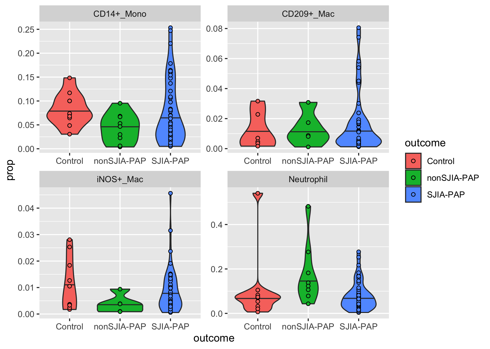
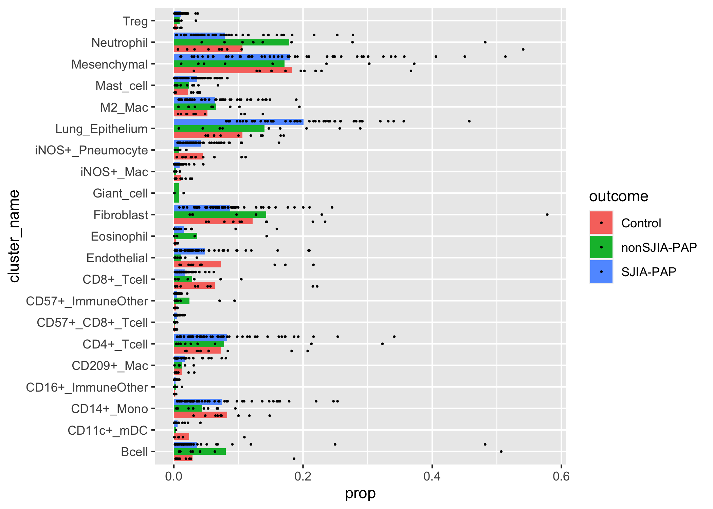
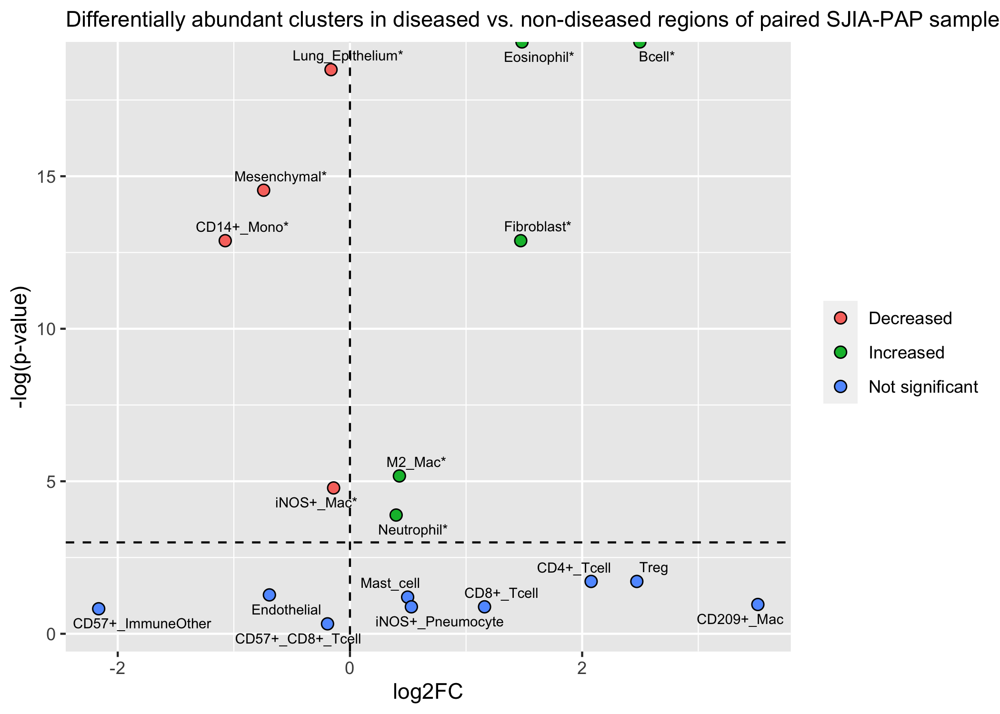
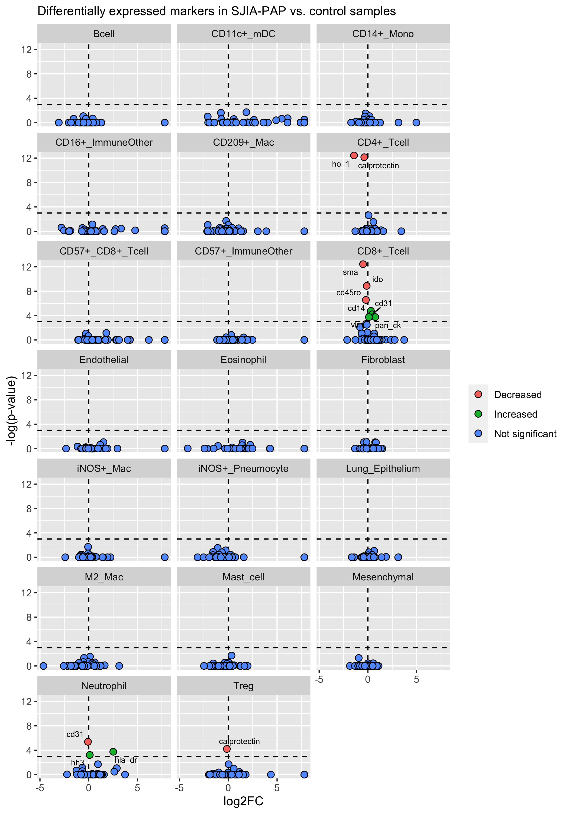

Aim 1 Differential Discovery Analysis
================

# Setup

``` r
# libraries
library(diffcyt)
library(tidyverse)
library(tidymodels)
library(lme4)

# source utils
source('~/GitHub/classes/BIOMEDIN_212/r_scripts/pap_utils.R', echo = FALSE)

# paths 
data_path <- 
  file.path("~", "GitHub", "classes", "BIOMEDIN_212", "data-raw", "cell_table.csv")

metadata_path <- 
  file.path(
    "~", "GitHub", "classes", 
    "BIOMEDIN_212", "data-raw", "fov_labels.csv"
  )

surfactant_path <- 
  file.path(
    "~", "GitHub", "classes", 
    "BIOMEDIN_212", "data-raw", "surfactant_masks"
  )

# globals
healthy_fovs_in_pap_patients <- 
  c(9, 15, 20, 29, 40)

functional_markers <- 
   c(
     "cd11c", "cd123", "cd14",
     "cd16", "cd163", "cd20", 
     "cd206", "cd209", "cd3", 
     "cd31", "cd4", "cd45", 
     "cd45ro", "cd57", "cd68", 
     "cd8", "calprotectin", 
     "epox", "foxp3", 
     "grz_b", "h3k27me3", "h3k9ac", 
     "hh3", "hla_dr", "ho_1", 
     "ido", "if_ng", "ki67", 
     "lag3", "mmp9", 
     "na_kat_pase", "pd1", "pan_ck", 
     "sma", "si", "tim3",
     "tryptase", "vim", 
     "i_nos", "p_s6"
   )
```

<div style="page-break-before: always;" />

# Read in data

``` r
# metadata 
metadata <- 
  metadata_path %>% 
  read_csv() %>% 
  rename(fov_id = point) %>% 
  janitor::clean_names()

# mibi data
mibi_data <- 
  data_path %>% 
  read_csv() %>% 
  rename(
    fov_id = point, 
    cell_id = label, 
    cluster_id = pixelfreq_hclust_cap,
    cluster_name = name, 
    centroid_x = `centroid-0`, 
    centroid_y = `centroid-1`
  ) %>% 
  janitor::clean_names()

# surfactant data
surf_data <- 
  tibble(
    filenames = 
      surfactant_path %>% 
      list.files(), 
    paths = 
      surfactant_path %>% 
      list.files(full.names = TRUE), 
    data = map(.x = paths, .f = pap_read_tif)
  )

surf_data <- 
  surf_data %>% 
  unnest(cols = data) %>% 
  transmute(
    fov_id = str_extract(filenames, pattern = "[:digit:]+"), 
    x, 
    y, 
    values
  )
```

<div style="page-break-before: always;" />

# Pre-process data

First, I’ll just join the metadata into the mibi\_data cell-level
expression matrix.

``` r
mibi_data <- 
  mibi_data %>% 
  left_join(metadata)

mibi_data %>% 
  count(category)
```

    ## # A tibble: 4 x 2
    ##   category        n
    ##   <chr>       <int>
    ## 1 nonSJIA-PAP 10584
    ## 2 Normal       4987
    ## 3 Pneumonia    6161
    ## 4 SJIA-PAP    57324

Because of our limited sample size, we more or less have to combine the
“Normal” and “Pneumonia” category FOVs into a single category
(“Control”). However, we should acknowledge that these two controls are
not created equal - in fact, if we perform a simple t-test between the
Pneumonia and Normal patient FOVs’ proportion of each our immune cell
clusters, we can see that there are significant differences (at the
level of p = 0.05) even after Benjamini-Hochberg adjustment.

``` r
cancer_pneumonia_counts <- 
  mibi_data %>% 
  filter(category %in% c("Pneumonia", "Normal")) %>% 
  mutate(cluster_name = as.factor(cluster_name)) %>% 
  count(patient_id, fov_id, category, cluster_name, .drop = FALSE) %>% 
  group_by(fov_id) %>% 
  mutate(prop = n / sum(n))

t_tests <- 
  cancer_pneumonia_counts %>% 
  group_by(cluster_name) %>% 
  nest() %>% 
  mutate(
    p_value =
      map_dbl(
        .x = data, 
        .f = ~ 
          t.test(
            x = 
              .x %>% 
              dplyr::filter(patient_id == 13) %>% 
              pull(prop), 
            y = 
              .x %>% 
              dplyr::filter(patient_id == 14) %>% 
              pull(prop)
          ) %>% 
          tidy() %>% 
          pull(p.value)
      ) %>% 
      p.adjust(method = "BH")
  )

t_tests %>% 
  select(-data) %>% 
  arrange(p_value) %>% 
  mutate(significant = if_else(p_value < 0.05, "*", "")) %>% 
  knitr::kable()
```

| cluster\_name      |  p\_value | significant |
|:-------------------|----------:|:------------|
| Mast\_cell         | 0.0024518 | \*          |
| Lung\_Epithelium   | 0.0042509 | \*          |
| CD57+\_CD8+\_Tcell | 0.0129929 | \*          |
| M2\_Mac            | 0.0230855 | \*          |
| Eosinophil         | 0.0341076 | \*          |
| Endothelial        | 0.0561127 |             |
| CD8+\_Tcell        | 0.0632200 |             |
| CD209+\_Mac        | 0.0735467 |             |
| iNOS+\_Pneumocyte  | 0.1045573 |             |
| CD16+\_ImmuneOther | 0.1383749 |             |
| Fibroblast         | 0.1780802 |             |
| CD11c+\_mDC        | 0.2475057 |             |
| Neutrophil         | 0.2509420 |             |
| Bcell              | 0.2793292 |             |
| iNOS+\_Mac         | 0.5925798 |             |
| CD57+\_ImmuneOther | 0.6663467 |             |
| CD4+\_Tcell        | 0.7789749 |             |
| Mesenchymal        | 0.9513561 |             |
| Treg               | 0.9617596 |             |
| CD14+\_Mono        | 0.9904512 |             |

``` r
cluster_order <- 
  t_tests %>% 
  arrange(p_value) %>% 
  pull(cluster_name) %>% 
  as.character()

sig_clusters <- 
  t_tests %>% 
  filter(p_value < 0.05) %>% 
  pull(cluster_name) %>% 
  as.character()

cancer_pneumonia_counts %>% 
  mutate(cluster_name = factor(cluster_name, levels = cluster_order)) %>% 
  filter(cluster_name %in% sig_clusters) %>% 
  ggplot(aes(y = prop, x = category, fill = category)) + 
  geom_violin() + 
  geom_jitter(shape = 21, width = 0.1) + 
  facet_wrap(facets = vars(cluster_name), scales = "free") + 
  labs(
    subtitle = "Differentially abundant clusters in our 2 control samples",
    x = NULL, 
    y = "Proportion of cells in a FOV in a cluster", 
    fill = NULL, 
    caption = "Each point represents an FOV;\nall means are significantly different at p = 0.05"
  )
```

<!-- -->

Keeping this in mind, we proceed with annotating the `outcome` variable
such that the pneumonia sample and cancer sample are treated equally as
“controls” (we would be relatively underpowered otherwise in later
comparisons, although this lumping is sub-optimal).

``` r
mibi_data <- 
  mibi_data %>% 
  mutate(
    outcome = 
      if_else(category %in% c("Normal", "Pneumonia"), "Control", category)
  )
```

<div style="page-break-before: always;" />

# Basic data summary

## Number of unique FOVs in each condition

``` r
mibi_data %>% 
  distinct(outcome, fov_id) %>% 
  count(outcome, name = "num_fovs") %>% 
  arrange(-num_fovs)
```

    ## # A tibble: 3 x 2
    ##   outcome     num_fovs
    ##   <chr>          <int>
    ## 1 SJIA-PAP          48
    ## 2 Control           10
    ## 3 nonSJIA-PAP        9

## Number of unique patients in each condition

``` r
mibi_data %>% 
  distinct(outcome, patient_id) %>% 
  count(outcome, name = "num_patients") %>% 
  arrange(-num_patients)
```

    ## # A tibble: 3 x 2
    ##   outcome     num_patients
    ##   <chr>              <int>
    ## 1 SJIA-PAP              12
    ## 2 Control                2
    ## 3 nonSJIA-PAP            2

## Number of unique cells in each condition

``` r
mibi_data %>% 
  count(outcome, name = "num_cells") %>% 
  arrange(-num_cells)
```

    ## # A tibble: 3 x 2
    ##   outcome     num_cells
    ##   <chr>           <int>
    ## 1 SJIA-PAP        57324
    ## 2 Control         11148
    ## 3 nonSJIA-PAP     10584

## Number of cells for each patient

``` r
mibi_data %>% 
  count(patient_id, name = "num_cells") %>% 
  arrange(-num_cells)
```

    ## # A tibble: 16 x 2
    ##    patient_id num_cells
    ##         <dbl>     <int>
    ##  1         11      8710
    ##  2         16      7705
    ##  3         13      6161
    ##  4         10      5811
    ##  5          9      5294
    ##  6          8      5061
    ##  7         14      4987
    ##  8          4      4972
    ##  9         12      4935
    ## 10          2      4590
    ## 11          5      4140
    ## 12          7      4115
    ## 13          3      4025
    ## 14          6      3433
    ## 15         15      2879
    ## 16          1      2238

## Number of cells in each FOV

``` r
mibi_data %>% 
  count(fov_id, name = "num_cells") %>% 
  arrange(-num_cells)
```

    ## # A tibble: 67 x 2
    ##    fov_id num_cells
    ##     <dbl>     <int>
    ##  1     14      2634
    ##  2     44      2341
    ##  3     12      2019
    ##  4     32      1924
    ##  5     43      1891
    ##  6      1      1885
    ##  7     25      1759
    ##  8     26      1754
    ##  9     49      1752
    ## 10     38      1726
    ## # … with 57 more rows

<div style="page-break-before: always;" />

# Differential Abundance Analysis - between patients

In Aim 1, we proposed a differential abundance analysis of different
immune cell subtypes (represented by the column `cluster_name` in
`mibi_data`) across different types of MIBI images. The first of these
analyses is to compare the abundance of each immune cell subtype between
independent patients, each of which has either SJIA-PAP, PAP caused by
something other than SJIA (nonSJIA-PAP), pneumonia, or lung cancer
(which we code as “Normal” in `mibi_data`). We combine the last two
conditions into the “control” category because neither of them have PAP,
so they make as much sense as any sample we have access to to form our
basis of comparison.

To perform our differential abundance analysis, we use the statistical
framework proposed in the
[{{diffcyt}}](https://www.nature.com/articles/s42003-019-0415-5)
framework.

Specifically, we use generalized linear mixed models (GLMMs) to test for
differences in cluster abundance and cluster marker expression. The
benefit of using mixed-models in this context is that, unlike more
traditional differential abundance/expression testing tools commonly
applied to cytometry data like
[CITRUS](https://www.ncbi.nlm.nih.gov/pmc/articles/PMC4084463/), GLMMs
can account for complex experimental designs such as paired or block
designs with known covariates representing batch effects or
individual-to-individual variation. In the case of the present study,
using random effects to model the variance in cluster abundance and
marker expression that arises from random variation between individual
patients (from whom we draw multiple FOVs), we can more reliably detect
differences attributable solely to the effect of the `outcome` variable.

To do this, we can use the `{diffcyt}` R package to test for
differential abundance of clusters across different levels of `outcome`
using binomial regression. For each cluster, we can fit a binomial
regression model in which we model the log-odds (and thus indirectly the
proportion of cells in a given cluster) of each cluster in a given
patient *i* and a given FOV *j* *p*<sub>*i**j*</sub> according to the
following equation:

$$
logit(p\_{ij}) = log(\\frac{p\_{ij}}{1 - p\_{ij}}) = \\beta\_0 + \\alpha\_i + \\beta\_1 X\_{j}
$$

In the equation above, we use the following definitions:

-   *p*<sub>*i**j*</sub>: The proportion of cells in a given cluster in
    patient *i* and FOV *j*
-   *α*<sub>*i*</sub><sup>(*p*)</sup>: A random intercept for each
    patient *i* in which *α*<sub>*i*</sub><sup>(*p*)</sup> \~
    *N*(0, *σ*<sub>*p*</sub>), where *σ*<sub>*p*</sub> is estimated
    during model fitting.
-   *X*<sub>*j*</sub>: an indicator variable representing whether or not
    an FOV j was taken from an SJIA-PAP patient (1 if yes, 0 otherwise).
    Depending on which comparisons we’re making, what *X*<sub>*j*</sub>
    stands for can change (but it always represents which `outcome` FOV
    j has been annotated with.
-   All *β*’s are linear model parameters optimized during model
    fitting.

Using the above setup, we can apply null-hypothesis significance testing
to *β*<sub>1</sub> (under the null hypothesis that *β*<sub>1</sub> = 0):
if *β*<sub>1</sub> is significantly different from 0 in the model, we
can state that the proportion of cells in our cluster differs
significantly between the levels of `outcome` we’re investigating while
controlling for individual-to-individual variation.

## PAP vs. non-PAP

Using this framework, we can first compare the PAP samples (either
SJIA-PAP or nonSJIA-PAP) to the control samples in our cohort. Note that
we set a filter so that clusters that have fewer than 3 cells in 5
samples are removed from the analysis, as clusters with this few cells
can’t be used to estimate reliable proportions for a cell subtype’s
relative abundance in the sample it was collected from.

``` r
pap_daa <- 
  mibi_data %>% 
  select(fov_id, cluster_name, outcome, patient_id, any_of(functional_markers)) %>%
  mutate(outcome = if_else(outcome %in% c("SJIA-PAP", "nonSJIA-PAP"), "PAP", outcome)) %>%
  pap_perform_daa(
    data_tibble = ., 
    sample_col = fov_id, 
    cluster_col = cluster_name, 
    fixed_effect_cols = outcome,
    random_effect_cols = c(patient_id), 
    include_observation_level_random_effects = FALSE
  )

pap_daa$da_results %>% 
  topTable(all = TRUE) %>% 
  as_tibble() %>% 
  arrange(p_adj) %>% 
  mutate(significance = if_else(p_adj < 0.05, "*", "")) %>% 
  knitr::kable()
```

| cluster\_id        |    p\_val |    p\_adj | significance |
|:-------------------|----------:|----------:|:-------------|
| CD209+\_Mac        | 0.0284889 | 0.2848894 |              |
| Neutrophil         | 0.0149365 | 0.2848894 |              |
| Bcell              | 0.3262681 | 0.7449216 |              |
| CD11c+\_mDC        | 0.1519862 | 0.7449216 |              |
| CD14+\_Mono        | 0.4472275 | 0.7449216 |              |
| CD57+\_CD8+\_Tcell | 0.4812898 | 0.7449216 |              |
| CD8+\_Tcell        | 0.2688716 | 0.7449216 |              |
| Endothelial        | 0.2369884 | 0.7449216 |              |
| Fibroblast         | 0.2432184 | 0.7449216 |              |
| iNOS+\_Mac         | 0.1652710 | 0.7449216 |              |
| iNOS+\_Pneumocyte  | 0.4402886 | 0.7449216 |              |
| Mesenchymal        | 0.4841990 | 0.7449216 |              |
| Treg               | 0.3633710 | 0.7449216 |              |
| CD16+\_ImmuneOther | 0.5616607 | 0.8023724 |              |
| CD4+\_Tcell        | 0.6354191 | 0.8074845 |              |
| CD57+\_ImmuneOther | 0.6459876 | 0.8074845 |              |
| Eosinophil         | 0.8001735 | 0.9413806 |              |
| Lung\_Epithelium   | 0.9541837 | 0.9541837 |              |
| M2\_Mac            | 0.9149582 | 0.9541837 |              |
| Mast\_cell         | 0.8741013 | 0.9541837 |              |
| Giant\_cell        |        NA |        NA | NA           |

From these results, we can see that, when taking indivual random-effects
into account, there are no statistically significant differentially
abundance clusters between PAP and non-PAP samples (at least at the
level of power we have available to us in this study).

``` r
overall_daa$da_results_limma %>% 
  topTable(all = TRUE) %>% 
  as_tibble()
```

## SJIA-PAP vs. Controls

The second comparison we can run is between SJIA-PAP samples and control
samples.

``` r
daa_sjia_pap_vs_controls <- 
  mibi_data %>% 
  select(fov_id, cluster_name, outcome, patient_id, any_of(functional_markers)) %>% 
  #filter(!(fov_id %in% healthy_fovs_in_pap_patients)) %>% 
  filter(outcome != "nonSJIA-PAP") %>% 
  pap_perform_daa(
    data_tibble = ., 
    sample_col = fov_id, 
    cluster_col = cluster_name, 
    fixed_effect_cols = outcome,
    random_effect_cols = c(patient_id), 
    include_observation_level_random_effects = FALSE
  )

daa_sjia_pap_vs_controls$da_results %>% 
  topTable(all = TRUE) %>% 
  as_tibble() %>% 
  arrange(p_adj) %>% 
  mutate(significance = if_else(p_adj < 0.05, "*", "")) %>% 
  knitr::kable()
```

| cluster\_id        |    p\_val |    p\_adj | significance |
|:-------------------|----------:|----------:|:-------------|
| Neutrophil         | 0.0000533 | 0.0010658 | \*           |
| CD11c+\_mDC        | 0.1296667 | 0.6439611 |              |
| CD14+\_Mono        | 0.3199656 | 0.6439611 |              |
| CD209+\_Mac        | 0.1100076 | 0.6439611 |              |
| CD8+\_Tcell        | 0.2086889 | 0.6439611 |              |
| Endothelial        | 0.2859825 | 0.6439611 |              |
| Fibroblast         | 0.2608195 | 0.6439611 |              |
| iNOS+\_Mac         | 0.1769249 | 0.6439611 |              |
| Mesenchymal        | 0.3219806 | 0.6439611 |              |
| Treg               | 0.2466686 | 0.6439611 |              |
| CD57+\_CD8+\_Tcell | 0.3558237 | 0.6469522 |              |
| Bcell              | 0.4690123 | 0.7785946 |              |
| CD4+\_Tcell        | 0.5060865 | 0.7785946 |              |
| CD16+\_ImmuneOther | 0.7383804 | 0.9488822 |              |
| CD57+\_ImmuneOther | 0.8849907 | 0.9488822 |              |
| Eosinophil         | 0.9014381 | 0.9488822 |              |
| Lung\_Epithelium   | 0.6759856 | 0.9488822 |              |
| M2\_Mac            | 0.8072448 | 0.9488822 |              |
| Mast\_cell         | 0.7877623 | 0.9488822 |              |
| iNOS+\_Pneumocyte  | 0.9523543 | 0.9523543 |              |

In these results, we can see that neutrophils are differentially
abundant in SJIA-PAP and control samples.

``` r
daa_sjia_pap_vs_controls$da_results_limma %>% 
  topTable(all = TRUE) %>% 
  as_tibble()
```

## SJIA-PAP vs. nonSJIA-PAP

The third comparison we can run is between SJIA-PAP and nonSJIA-PAP
samples.

``` r
daa_sjia_pap_vs_nonsjia_pap <- 
  mibi_data %>% 
  select(fov_id, cluster_name, outcome, patient_id, any_of(functional_markers)) %>% 
  filter(outcome != "Control") %>% 
  pap_perform_daa(
    data_tibble = ., 
    sample_col = fov_id, 
    cluster_col = cluster_name, 
    fixed_effect_cols = outcome,
    random_effect_cols = c(patient_id), 
    include_observation_level_random_effects = FALSE
  )

daa_sjia_pap_vs_nonsjia_pap$da_results %>% 
  topTable(all = TRUE) %>% 
  as_tibble() %>% 
  arrange(p_adj) %>% 
  mutate(significance = if_else(p_adj < 0.05, "*", ""))
```

    ## # A tibble: 21 x 4
    ##    cluster_id         p_val p_adj significance
    ##    <fct>              <dbl> <dbl> <chr>       
    ##  1 CD209+_Mac        0.126  0.595 ""          
    ##  2 CD4+_Tcell        0.0965 0.595 ""          
    ##  3 CD57+_ImmuneOther 0.0777 0.595 ""          
    ##  4 M2_Mac            0.149  0.595 ""          
    ##  5 Mesenchymal       0.0569 0.595 ""          
    ##  6 Fibroblast        0.184  0.614 ""          
    ##  7 CD16+_ImmuneOther 0.247  0.618 ""          
    ##  8 Treg              0.217  0.618 ""          
    ##  9 Neutrophil        0.358  0.795 ""          
    ## 10 Bcell             0.494  0.824 ""          
    ## # … with 11 more rows

And once again we can see that there are no differentially abundant
clusters between these sample types.

``` r
daa_sjia_pap_vs_nonsjia_pap$da_results_limma %>% 
  topTable(all = TRUE) %>% 
  as_tibble()
```

## nonSJIA-PAP vs. Controls

The final between-patients comparison we can run is between nonSJIA-PAP
samples and control samples.

``` r
daa_control_vs_nonsjia_pap <- 
  mibi_data %>% 
  select(fov_id, cluster_name, outcome, patient_id, any_of(functional_markers)) %>% 
  #filter(!(fov_id %in% healthy_fovs_in_pap_patients)) %>% 
  filter(outcome != "SJIA-PAP") %>% 
  pap_perform_daa(
    data_tibble = ., 
    sample_col = fov_id, 
    cluster_col = cluster_name, 
    fixed_effect_cols = outcome,
    random_effect_cols = c(patient_id), 
    include_observation_level_random_effects = FALSE
  )

daa_control_vs_nonsjia_pap$da_results %>% 
  topTable(all = TRUE) %>% 
  as_tibble() %>% 
  arrange(p_adj) %>% 
  mutate(significance = if_else(p_adj < 0.05, "*", ""))
```

    ## # A tibble: 21 x 4
    ##    cluster_id           p_val   p_adj significance
    ##    <fct>                <dbl>   <dbl> <chr>       
    ##  1 iNOS+_Pneumocyte  0.000208 0.00416 "*"         
    ##  2 CD14+_Mono        0.00768  0.0487  "*"         
    ##  3 Endothelial       0.00974  0.0487  "*"         
    ##  4 iNOS+_Mac         0.00658  0.0487  "*"         
    ##  5 CD57+_ImmuneOther 0.0125   0.0502  ""          
    ##  6 CD16+_ImmuneOther 0.0346   0.115   ""          
    ##  7 Bcell             0.119    0.283   ""          
    ##  8 Fibroblast        0.127    0.283   ""          
    ##  9 Treg              0.122    0.283   ""          
    ## 10 CD11c+_mDC        0.312    0.567   ""          
    ## # … with 11 more rows

And in this case we can see that there are several cell subtypes that
are differentially abundant (pneumocytes, monocytes, endothelial cells,
and iNOS+ Macrophages).

``` r
daa_control_vs_nonsjia_pap$da_results_limma %>% 
  topTable(all = TRUE) %>% 
  as_tibble()
```

## Visualization

``` r
interesting_clusters <- 
  c("Neutrophil", "CD209+_Mac", "CD14+_Mono", "iNOS+_Mac")

mibi_data %>% 
  count(fov_id, cluster_name, patient_id, outcome) %>% 
  group_by(fov_id) %>% 
  mutate(
    total_cells = sum(n), 
    prop = n / total_cells
  ) %>% 
  filter(cluster_name %in% interesting_clusters) %>% 
  ggplot(aes(x = outcome, y = prop, fill = outcome)) + 
  geom_violin(draw_quantiles = 0.5) + 
  geom_point(shape = 21, position = position_dodge(width = 0.3)) + 
  facet_wrap(facets = vars(cluster_name), scales = "free")
```

<!-- -->

``` r
mibi_data %>% 
  count(fov_id, cluster_name, patient_id, outcome) %>% 
  group_by(fov_id) %>% 
  mutate(
    total_cells = sum(n), 
    prop = n / total_cells
  ) %>%  
  group_by(cluster_name, outcome) %>% 
  summarize(prop = mean(prop)) %>% 
  ggplot(aes(y = cluster_name, x = prop, fill = outcome)) + 
  geom_col(position = "dodge") + 
  geom_point(
    position = position_dodge(width = 1), 
    size = 0.2, 
    data = 
      mibi_data %>% 
      count(fov_id, cluster_name, patient_id, outcome) %>% 
      group_by(fov_id) %>% 
      mutate(
        total_cells = sum(n), 
        prop = n / total_cells
      ) %>% 
      ungroup()
  )
```

<!-- -->

<div style="page-break-before: always;" />

# Differential Abundance Analysis - within patients

In addition to the between-patients comparisons, we can also run another
set of comparisons that leverages a within-subjects design to increase
statistical power. As it turns out, for several of our SJIA-PAP samples,
one of the FOVs collected was annotated as a “healthy” section of tissue
relative to the others (which had more of the hallmark histopathological
features of SJIA-PAP). We can compare the abundance of each of our
immune cell subpopulations within the same patients by comparing the
“healthy” FOV to the other FOVs taken from the same patient.

``` r
# find patients who had at least one "healthy" FOV
interesting_patients <- 
  mibi_data %>% 
  filter(fov_id %in% healthy_fovs_in_pap_patients) %>% 
  distinct(patient_id) %>% 
  pull(patient_id)

interesting_patients
```

    ## [1] 16  8  9 11  1

## Processing

``` r
paired_patients <- 
  mibi_data %>% 
  filter(patient_id %in% interesting_patients) %>% 
  # annotate FOVs that are "healthy-looking" according to our pathologist
  mutate(
    fov_condition = 
           if_else(fov_id %in% healthy_fovs_in_pap_patients, "healthy", "pap")
  )
```

## Statistical analysis

``` r
paired_daa_results <- 
  paired_patients %>% 
  filter(outcome != "nonSJIA-PAP") %>% 
  pap_perform_daa(
    data_tibble = ., 
    sample_col = fov_id, 
    cluster_col = cluster_name, 
    fixed_effect_cols = fov_condition, 
    random_effect_cols = patient_id, 
    include_observation_level_random_effects = FALSE
  )

paired_daa_results %>% 
  pluck("da_results") %>% 
  topTable(all = TRUE) %>% 
  as_tibble() %>% 
  mutate(significant = if_else(p_adj < 0.05, "*", "")) %>% 
  arrange(p_adj) %>%  
  knitr::kable()
```

| cluster\_id        |    p\_val |    p\_adj | significant |
|:-------------------|----------:|----------:|:------------|
| Bcell              | 0.0000000 | 0.0000000 | \*          |
| Eosinophil         | 0.0000000 | 0.0000000 | \*          |
| Lung\_Epithelium   | 0.0000000 | 0.0000000 | \*          |
| Mesenchymal        | 0.0000001 | 0.0000005 | \*          |
| CD14+\_Mono        | 0.0000008 | 0.0000025 | \*          |
| Fibroblast         | 0.0000007 | 0.0000025 | \*          |
| M2\_Mac            | 0.0022011 | 0.0056600 | \*          |
| iNOS+\_Mac         | 0.0037262 | 0.0083839 | \*          |
| Neutrophil         | 0.0102007 | 0.0204013 | \*          |
| CD4+\_Tcell        | 0.1098600 | 0.1797709 |             |
| Treg               | 0.1097409 | 0.1797709 |             |
| Endothelial        | 0.1863928 | 0.2795892 |             |
| Mast\_cell         | 0.2171053 | 0.3006073 |             |
| CD209+\_Mac        | 0.2976274 | 0.3826638 |             |
| CD8+\_Tcell        | 0.3671814 | 0.4130791 |             |
| iNOS+\_Pneumocyte  | 0.3620723 | 0.4130791 |             |
| CD57+\_ImmuneOther | 0.4157340 | 0.4401889 |             |
| CD57+\_CD8+\_Tcell | 0.7218197 | 0.7218197 |             |
| CD11c+\_mDC        |        NA |        NA | NA          |
| CD16+\_ImmuneOther |        NA |        NA | NA          |

``` r
paired_daa_results %>% 
  pluck("da_results_limma") %>% 
  topTable(all = TRUE) %>% 
  as_tibble() %>% 
  mutate(significant = if_else(p_adj < 0.05, "*", "")) %>% 
  arrange(p_adj)
```

From these results, we can see that there are several immune cell
subtypes that, when using a paired design, we find are enriched in parts
of the SJIA-PAP lung that actually show histopathological signs of
disease compared to paired parts of the SJIA-PAP lung that do not show
histopathological signs of disease.

We can visualize these differences below.

## Visualization

``` r
paired_p_values <- 
  paired_daa_results %>% 
  pluck("da_results") %>% 
  topTable(all = TRUE) %>% 
  as_tibble() %>% 
  mutate(
    significant = if_else(p_adj < 0.05, "*", ""), 
    new_cluster_name = if_else(significant == "*", str_c(cluster_id, "*"), as.character(cluster_id))
  ) %>% 
  arrange(p_adj) %>% 
  rename(cluster_name = cluster_id)

sig_clusters <- 
  paired_p_values %>% 
  filter(significant == "*") %>% 
  pull(cluster_name)

# calculate the number of fovs used for each patient in each "condition"
num_fov_tibble <- 
  paired_patients %>% 
  distinct(fov_id, patient_id, fov_condition) %>% 
  count(patient_id, fov_condition, name = "num_fovs")

paired_plot_data <- 
  paired_patients %>% 
  mutate(
    cluster_name = 
      factor(cluster_name, levels = pull(paired_p_values, cluster_name)) , 
  ) %>% 
  count(cluster_name, patient_id, fov_id, fov_condition, .drop = FALSE) %>%
  group_by(fov_id) %>% 
  mutate(
    total_fov_cells = sum(n),
    prop = n / total_fov_cells
  ) %>% 
  ungroup() %>% 
  group_by(fov_condition, patient_id, cluster_name) %>% 
  summarize(
    sd = sd(prop, na.rm = TRUE),
    prop = mean(prop, na.rm = TRUE), 
  ) %>% 
  drop_na(cluster_name) %>% 
  ungroup() %>% 
  #mutate(across(c(patient_id, fov_condition), .f = as.factor)) %>% 
  complete(patient_id, fov_condition, cluster_name, fill = list(prop = 0)) %>% 
  left_join(num_fov_tibble) %>% 
  mutate(
    sem = sd / sqrt(num_fovs)
  )
```

``` r
paired_plot_data %>% 
  left_join(paired_p_values) %>% 
  mutate(new_cluster_name = fct_reorder(new_cluster_name, p_adj)) %>%  
  drop_na(new_cluster_name) %>% 
  ggplot(aes(y = prop, x = fov_condition, fill = fov_condition)) + 
  geom_line(aes(group = patient_id), color = "black") + 
  geom_errorbar(
    aes(x = fov_condition, y = prop, ymin = prop - sem, ymax = prop + sem),
    width = 0.2, 
    alpha = 0.7
  ) +
  geom_point(shape = 21) + 
  #scale_y_continuous(oob = scales::oob_squish_infinite) + 
  facet_wrap(facets = vars(new_cluster_name), scales = "free", ncol = 4) + 
  labs(
    x = NULL, 
    y = "Proportion of cells"
  )
```

<!-- -->

``` r
paired_plot_data %>% 
  left_join(paired_p_values) %>% 
  mutate(new_cluster_name = fct_reorder(new_cluster_name, p_adj)) %>%  
  drop_na(new_cluster_name) %>% 
  select(patient_id, fov_condition, new_cluster_name, prop, p_adj) %>% 
  pivot_wider(
    names_from = fov_condition, 
    values_from = prop
  ) %>% 
  group_by(new_cluster_name) %>% 
  summarize(across(c(healthy, pap), mean, na.rm = TRUE)) %>% 
  mutate(
    fc = pap / healthy, 
    log2_fc = log(fc, base = 2)
  ) %>% 
  left_join(paired_p_values) %>% 
  mutate(
    neg_log_p_val = -log(p_adj),
    cluster_type = 
      case_when(
        p_adj > 0.05 ~ "Not significant", 
        fc > 1       ~ "Increased", 
        fc < 1       ~ "Decreased"
      )
  ) %>% 
  ggplot(aes(x = log2_fc, y = neg_log_p_val, fill = cluster_type)) + 
  geom_hline(yintercept = -log(0.05), color = "black", linetype = "dashed") + 
  geom_vline(xintercept = 0, color = "black", linetype = "dashed") +
  geom_point(shape = 21, size = 2.5) + 
  ggrepel::geom_text_repel(aes(label = new_cluster_name), size = 2.5, color = "black") + 
  labs(
    subtitle = "Differentially abundant clusters in diseased vs. non-diseased regions of paired SJIA-PAP samples", 
    x = "log2FC", 
    y = "-log(p-value)",
    fill = NULL
  )
```

<!-- -->

<div style="page-break-before: always;" />

# Differential Expression Analysis - between patients

\[Blurb about how we’re doing the same as the between-patients design
above, but this time using a LMM to predict median marker expression for
each cluster\]

## PAP vs. non-PAP

``` r
pap_dea <- 
  mibi_data %>% 
  select(fov_id, cluster_name, outcome, patient_id, any_of(functional_markers)) %>%
  mutate(outcome = if_else(outcome %in% c("SJIA-PAP", "nonSJIA-PAP"), "PAP", outcome)) %>% 
  pap_perform_dea(
    data_tibble = ., 
    sample_col = fov_id, 
    cluster_col = cluster_name, 
    fixed_effect_cols = outcome,
    random_effect_col = c(patient_id), 
    min_cells = 5, 
    min_samples = 5 
  )

# only show the top 25 most significant results
pap_dea$de_results %>% 
  topTable(top_n = 25) %>% 
  as_tibble() %>% 
  arrange(p_adj) %>% 
  mutate(significance = if_else(p_adj < 0.05, "*", "")) %>% 
  knitr::kable()
```

| cluster\_id | marker\_id   |    p\_val |    p\_adj | significance |
|:------------|:-------------|----------:|----------:|:-------------|
| CD4+\_Tcell | ho\_1        | 0.0000000 | 0.0000003 | \*           |
| CD8+\_Tcell | ido          | 0.0000000 | 0.0000120 | \*           |
| Treg        | calprotectin | 0.0000001 | 0.0000227 | \*           |
| CD8+\_Tcell | sma          | 0.0000037 | 0.0007343 | \*           |
| Neutrophil  | cd31         | 0.0000072 | 0.0011498 | \*           |
| CD8+\_Tcell | cd45ro       | 0.0000337 | 0.0044886 | \*           |
| Neutrophil  | hh3          | 0.0001206 | 0.0137804 | \*           |
| CD8+\_Tcell | cd14         | 0.0001441 | 0.0144104 | \*           |
| CD8+\_Tcell | cd31         | 0.0004699 | 0.0376558 | \*           |
| Mast\_cell  | calprotectin | 0.0004707 | 0.0376558 | \*           |
| M2\_Mac     | cd31         | 0.0006038 | 0.0439119 | \*           |
| CD14+\_Mono | cd31         | 0.0007405 | 0.0447756 | \*           |
| Neutrophil  | hla\_dr      | 0.0007836 | 0.0447756 | \*           |
| CD8+\_Tcell | vim          | 0.0007542 | 0.0447756 | \*           |
| Neutrophil  | cd45ro       | 0.0014519 | 0.0725940 |              |
| CD11c+\_mDC | hla\_dr      | 0.0013935 | 0.0725940 |              |
| CD4+\_Tcell | cd45ro       | 0.0017349 | 0.0816402 |              |
| iNOS+\_Mac  | vim          | 0.0024281 | 0.1079161 |              |
| Treg        | cd163        | 0.0032848 | 0.1274656 |              |
| Eosinophil  | ido          | 0.0033460 | 0.1274656 |              |
| CD8+\_Tcell | p\_s6        | 0.0032649 | 0.1274656 |              |
| CD4+\_Tcell | calprotectin | 0.0039012 | 0.1300399 |              |
| CD8+\_Tcell | hh3          | 0.0038458 | 0.1300399 |              |
| CD8+\_Tcell | pan\_ck      | 0.0035863 | 0.1300399 |              |
| Bcell       | cd8          | 0.0041655 | 0.1321142 |              |

## SJIA-PAP vs. Controls

``` r
dea_sjia_pap_vs_controls <- 
  mibi_data %>% 
  select(fov_id, cluster_name, outcome, patient_id, any_of(functional_markers)) %>%
  #filter(!(fov_id %in% healthy_fovs_in_pap_patients)) %>% 
  filter(outcome != "nonSJIA-PAP") %>% 
  pap_perform_dea(
    data_tibble = ., 
    sample_col = fov_id, 
    cluster_col = cluster_name, 
    fixed_effect_cols = outcome,
    random_effect_col = c(patient_id), 
    min_cells = 5, 
    min_samples = 5
  )

dea_sjia_pap_vs_controls$de_results %>% 
  topTable(top_n = 25) %>% 
  as_tibble() %>% 
  arrange(p_adj) %>% 
  mutate(significance = if_else(p_adj < 0.05, "*", "")) %>% 
  knitr::kable()
```

| cluster\_id | marker\_id   |    p\_val |    p\_adj | significance |
|:------------|:-------------|----------:|----------:|:-------------|
| CD4+\_Tcell | ho\_1        | 0.0000000 | 0.0000040 | \*           |
| CD8+\_Tcell | sma          | 0.0000000 | 0.0000040 | \*           |
| CD4+\_Tcell | calprotectin | 0.0000000 | 0.0000053 | \*           |
| CD8+\_Tcell | ido          | 0.0000007 | 0.0001413 | \*           |
| CD8+\_Tcell | cd45ro       | 0.0000088 | 0.0014110 | \*           |
| Neutrophil  | cd31         | 0.0000346 | 0.0046129 | \*           |
| CD8+\_Tcell | cd14         | 0.0000745 | 0.0085159 | \*           |
| CD8+\_Tcell | cd31         | 0.0001685 | 0.0149745 | \*           |
| Treg        | calprotectin | 0.0001672 | 0.0149745 | \*           |
| Neutrophil  | hla\_dr      | 0.0003534 | 0.0235578 | \*           |
| CD8+\_Tcell | pan\_ck      | 0.0003145 | 0.0235578 | \*           |
| CD8+\_Tcell | vim          | 0.0003497 | 0.0235578 | \*           |
| Neutrophil  | hh3          | 0.0006470 | 0.0398161 | \*           |
| CD8+\_Tcell | cd4          | 0.0013638 | 0.0727353 |              |
| CD4+\_Tcell | cd45ro       | 0.0012871 | 0.0727353 |              |
| CD8+\_Tcell | hh3          | 0.0016627 | 0.0831329 |              |
| CD8+\_Tcell | calprotectin | 0.0026299 | 0.1237621 |              |
| Treg        | cd163        | 0.0043787 | 0.1821522 |              |
| Neutrophil  | cd45ro       | 0.0047842 | 0.1821522 |              |
| Mast\_cell  | calprotectin | 0.0050092 | 0.1821522 |              |
| CD11c+\_mDC | hla\_dr      | 0.0047077 | 0.1821522 |              |
| iNOS+\_Mac  | vim          | 0.0046123 | 0.1821522 |              |
| CD209+\_Mac | hla\_dr      | 0.0052589 | 0.1829181 |              |
| CD11c+\_mDC | h3k27me3     | 0.0060519 | 0.2017299 |              |
| M2\_Mac     | cd31         | 0.0069729 | 0.2147075 |              |

## SJIA-PAP vs. nonSJIA-PAP

``` r
dea_sjia_pap_vs_nonsjia_pap <- 
  mibi_data %>% 
  select(fov_id, cluster_name, outcome, patient_id, any_of(functional_markers)) %>%
  #filter(!(fov_id %in% healthy_fovs_in_pap_patients)) %>% 
  filter(outcome != "Control") %>% 
  pap_perform_dea(
    data_tibble = ., 
    sample_col = fov_id, 
    cluster_col = cluster_name, 
    fixed_effect_cols = outcome,
    random_effect_col = c(patient_id), 
    min_cells = 20, 
    min_samples = 10
  )

dea_sjia_pap_vs_nonsjia_pap$de_results %>% 
  topTable(top_n = 25) %>% 
  as_tibble() %>% 
  arrange(p_adj) %>% 
  mutate(significance = if_else(p_adj < 0.05, "*", "")) %>% 
  knitr::kable()
```

| cluster\_id       | marker\_id   |    p\_val |    p\_adj | significance |
|:------------------|:-------------|----------:|----------:|:-------------|
| Mesenchymal       | lag3         | 0.0000161 | 0.0090116 | \*           |
| iNOS+\_Pneumocyte | lag3         | 0.0001722 | 0.0482035 | \*           |
| Mesenchymal       | vim          | 0.0003095 | 0.0577704 |              |
| CD8+\_Tcell       | cd123        | 0.0010664 | 0.0996289 |              |
| CD8+\_Tcell       | lag3         | 0.0008544 | 0.0996289 |              |
| iNOS+\_Pneumocyte | vim          | 0.0010675 | 0.0996289 |              |
| Endothelial       | cd206        | 0.0020487 | 0.1409582 |              |
| CD4+\_Tcell       | calprotectin | 0.0018725 | 0.1409582 |              |
| Endothelial       | ido          | 0.0025171 | 0.1409582 |              |
| Mast\_cell        | vim          | 0.0024047 | 0.1409582 |              |
| CD4+\_Tcell       | cd123        | 0.0046176 | 0.1879792 |              |
| M2\_Mac           | cd123        | 0.0039847 | 0.1879792 |              |
| Mast\_cell        | lag3         | 0.0046995 | 0.1879792 |              |
| Neutrophil        | lag3         | 0.0040967 | 0.1879792 |              |
| CD8+\_Tcell       | hla\_dr      | 0.0059429 | 0.2218684 |              |
| Mast\_cell        | cd123        | 0.0068880 | 0.2410811 |              |
| Fibroblast        | lag3         | 0.0074621 | 0.2458120 |              |
| CD14+\_Mono       | cd123        | 0.0147420 | 0.2948396 |              |
| Mesenchymal       | cd123        | 0.0118887 | 0.2948396 |              |
| CD8+\_Tcell       | cd45ro       | 0.0141040 | 0.2948396 |              |
| Endothelial       | cd45ro       | 0.0136826 | 0.2948396 |              |
| iNOS+\_Pneumocyte | hh3          | 0.0120917 | 0.2948396 |              |
| Mast\_cell        | hh3          | 0.0146146 | 0.2948396 |              |
| Mesenchymal       | hh3          | 0.0123219 | 0.2948396 |              |
| M2\_Mac           | lag3         | 0.0110886 | 0.2948396 |              |

## nonSJIA-PAP vs. Controls

``` r
dea_control_vs_nonsjia_pap <- 
  mibi_data %>% 
  select(fov_id, cluster_name, outcome, patient_id, any_of(functional_markers)) %>%
  #filter(!(fov_id %in% healthy_fovs_in_pap_patients)) %>% 
  filter(outcome != "SJIA-PAP") %>% 
  pap_perform_dea(
    data_tibble = ., 
    sample_col = fov_id, 
    cluster_col = cluster_name, 
    fixed_effect_cols = outcome,
    random_effect_col = c(patient_id), 
    min_cells = 20, 
    min_samples = 10
  )

dea_control_vs_nonsjia_pap$de_results %>% 
  topTable(top_n = 25) %>% 
  as_tibble() %>% 
  arrange(p_adj) %>% 
  mutate(significance = if_else(p_adj < 0.05, "*", "")) %>% 
  knitr::kable()
```

| cluster\_id | marker\_id    |    p\_val |    p\_adj | significance |
|:------------|:--------------|----------:|----------:|:-------------|
| Neutrophil  | cd14          | 0.0000717 | 0.0177454 | \*           |
| CD8+\_Tcell | cd45          | 0.0002662 | 0.0177454 | \*           |
| M2\_Mac     | cd45          | 0.0001778 | 0.0177454 | \*           |
| M2\_Mac     | cd68          | 0.0001100 | 0.0177454 | \*           |
| CD4+\_Tcell | hh3           | 0.0002257 | 0.0177454 | \*           |
| CD4+\_Tcell | vim           | 0.0001781 | 0.0177454 | \*           |
| Neutrophil  | cd163         | 0.0006408 | 0.0366184 | \*           |
| M2\_Mac     | cd163         | 0.0010146 | 0.0474647 | \*           |
| Mast\_cell  | tryptase      | 0.0010680 | 0.0474647 | \*           |
| CD4+\_Tcell | cd45          | 0.0011993 | 0.0479737 | \*           |
| CD8+\_Tcell | cd8           | 0.0016696 | 0.0513734 |              |
| M2\_Mac     | calprotectin  | 0.0016307 | 0.0513734 |              |
| M2\_Mac     | na\_kat\_pase | 0.0014304 | 0.0513734 |              |
| Mast\_cell  | hh3           | 0.0021202 | 0.0605763 |              |
| CD8+\_Tcell | cd45ro        | 0.0030115 | 0.0803060 |              |
| M2\_Mac     | cd11c         | 0.0037483 | 0.0881944 |              |
| CD4+\_Tcell | lag3          | 0.0036630 | 0.0881944 |              |
| Neutrophil  | cd45ro        | 0.0040223 | 0.0893840 |              |
| Mast\_cell  | ido           | 0.0054926 | 0.1156347 |              |
| M2\_Mac     | ho\_1         | 0.0069143 | 0.1279904 |              |
| Mesenchymal | na\_kat\_pase | 0.0068203 | 0.1279904 |              |
| CD4+\_Tcell | pd1           | 0.0070395 | 0.1279904 |              |
| CD4+\_Tcell | cd123         | 0.0075248 | 0.1292888 |              |
| M2\_Mac     | vim           | 0.0080806 | 0.1292888 |              |
| Neutrophil  | vim           | 0.0077610 | 0.1292888 |              |

## Visualization

``` r
dea_sjia_pap_vs_control_results <- 
  dea_sjia_pap_vs_controls$de_results %>% 
  topTable(all = TRUE) %>% 
  as_tibble() %>% 
  arrange(p_adj) %>% 
  mutate(significance = if_else(p_adj < 0.05, "*", ""))  %>% 
  rename(cluster_name = cluster_id)

# number of significantly different markers in each cluster
dea_sjia_pap_vs_control_results %>% 
  filter(significance == "*") %>% 
  count(cluster_name)
```

    ## # A tibble: 4 x 2
    ##   cluster_name     n
    ##   <fct>        <int>
    ## 1 CD4+_Tcell       2
    ## 2 CD8+_Tcell       7
    ## 3 Neutrophil       3
    ## 4 Treg             1

``` r
feature_volcano_tibble <- 
  mibi_data %>% 
  filter(outcome != "nonSJIA-PAP") %>% 
  group_by(cluster_name, outcome, patient_id) %>% 
  summarize(across(any_of(functional_markers), .f = mean, na.rm = TRUE)) %>% 
  ungroup() %>% 
  pivot_longer(
    cols = any_of(functional_markers), 
    names_to = "marker_id", 
    values_to = "median"
  ) %>% 
  group_by(outcome, marker_id, cluster_name) %>% 
  summarize(median = mean(median, na.rm = TRUE)) %>% 
  ungroup() %>% 
  pivot_wider(
    names_from = outcome, 
    values_from = median
  ) %>% 
  mutate(
    fc = `SJIA-PAP` / Control, 
    log2_fc = log(fc, base = 2)
  ) %>% 
  #filter(!is.nan(fc)) %>% 
  left_join(
    dea_sjia_pap_vs_control_results %>% 
      drop_na()
  ) %>% 
  arrange(p_adj) %>% 
  mutate(
    neg_log_p_val = -log(p_adj), 
    feature_type = 
      case_when(
        p_adj > 0.05 ~ "Not significant", 
        fc < 1       ~ "Decreased", 
        fc > 1       ~ "Increased"
      ), 
    feature = str_c(marker_id, cluster_name, sep = "@"), 
  ) %>% 
  drop_na(feature_type, significance)

feature_volcano_tibble %>% 
  ggplot(aes(x = log2_fc, y = neg_log_p_val, fill = feature_type)) + 
  geom_hline(yintercept = -log(0.05), color = "black", linetype = "dashed") + 
  geom_vline(xintercept = 0, color = "black", linetype = "dashed") +
  geom_point(shape = 21, size = 2.5) + 
  ggrepel::geom_text_repel(
    aes(label = marker_id), 
    data = filter(feature_volcano_tibble, feature_type != "Not significant"), 
    size = 2.5, 
    color = "black"
  ) + 
  scale_x_continuous(oob = scales::oob_squish_infinite) + 
  scale_y_continuous(oob = scales::oob_squish_infinite) + 
  facet_wrap(facets = vars(cluster_name), ncol = 3) + 
  labs(
    subtitle = "Differentially expressed markers in SJIA-PAP vs. control samples", 
    x = "log2FC", 
    y = "-log(p-value)",
    fill = NULL
  )
```

<!-- -->

<div style="page-break-before: always;" />

# Differential Expression Analysis - within patients

``` r
paired_dea_results <- 
  paired_patients %>% 
  filter(outcome != "nonSJIA-PAP") %>% 
  select(
    fov_id,
    cluster_name, 
    fov_condition, 
    patient_id, 
    any_of(functional_markers)
  ) %>% 
  pap_perform_dea(
    data_tibble = ., 
    sample_col = fov_id, 
    cluster_col = cluster_name, 
    fixed_effect_cols = fov_condition, 
    random_effect_col = c(patient_id), 
    min_cells = 5, 
    min_samples = 5
  )

paired_dea_results %>% 
  pluck("de_results") %>% 
  topTable(top_n = 25) %>% 
  as_tibble() %>% 
  mutate(significant = if_else(p_adj < 0.10, "*", "")) %>% 
  arrange(p_adj) %>% 
  knitr::kable()
```

| cluster\_id       | marker\_id |    p\_val |    p\_adj | significant |
|:------------------|:-----------|----------:|----------:|:------------|
| Eosinophil        | cd31       | 0.0000922 | 0.0313411 | \*          |
| CD209+\_Mac       | ho\_1      | 0.0000870 | 0.0313411 | \*          |
| Eosinophil        | hh3        | 0.0002986 | 0.0676921 | \*          |
| Eosinophil        | vim        | 0.0008043 | 0.1367321 |             |
| Eosinophil        | pan\_ck    | 0.0010167 | 0.1382757 |             |
| CD14+\_Mono       | hh3        | 0.0024189 | 0.2741378 |             |
| Mesenchymal       | cd45ro     | 0.0031148 | 0.3025807 |             |
| iNOS+\_Pneumocyte | cd45ro     | 0.0044107 | 0.3749120 |             |
| M2\_Mac           | cd45ro     | 0.0052723 | 0.3983509 |             |
| Bcell             | cd31       | 0.0089437 | 0.4933762 |             |
| Eosinophil        | cd45ro     | 0.0089218 | 0.4933762 |             |
| Mast\_cell        | cd45ro     | 0.0074826 | 0.4933762 |             |
| CD8+\_Tcell       | hh3        | 0.0094322 | 0.4933762 |             |
| CD4+\_Tcell       | cd45ro     | 0.0132830 | 0.6021623 |             |
| Neutrophil        | cd45ro     | 0.0132431 | 0.6021623 |             |
| CD8+\_Tcell       | cd45ro     | 0.0173989 | 0.6262957 |             |
| Treg              | hh3        | 0.0163440 | 0.6262957 |             |
| Neutrophil        | lag3       | 0.0153198 | 0.6262957 |             |
| Endothelial       | pan\_ck    | 0.0184205 | 0.6262957 |             |
| iNOS+\_Mac        | pan\_ck    | 0.0179964 | 0.6262957 |             |
| CD14+\_Mono       | sma        | 0.0211224 | 0.6839636 |             |
| Neutrophil        | cd123      | 0.0315969 | 0.7036612 |             |
| CD209+\_Mac       | cd14       | 0.0254273 | 0.7036612 |             |
| CD14+\_Mono       | cd31       | 0.0295660 | 0.7036612 |             |
| CD4+\_Tcell       | cd31       | 0.0320787 | 0.7036612 |             |

``` eval
paired_dea_results_2 <- 
  testDS_LMM(
    d_counts = calcCounts(paired_dea_results$data_diff), 
    d_medians = calcMedians(paired_dea_results$data_diff), 
    formula = paired_dea_results$my_formula, 
    contrast = paired_dea_results$my_contrast, 
    min_cells = 10, 
    min_samples = 5, 
    markers_to_test = rep(TRUE, nrow(paired_dea_results$marker_info))
  )

paired_dea_results_2 %>% 
  topTable(all = TRUE) %>% 
  as_tibble() %>% 
  mutate(significant = if_else(p_adj < 0.10, "*", "")) %>% 
  arrange(p_adj)
```

<div style="page-break-before: always;" />

# Spatial Analysis

\[surfactant analysis\]
