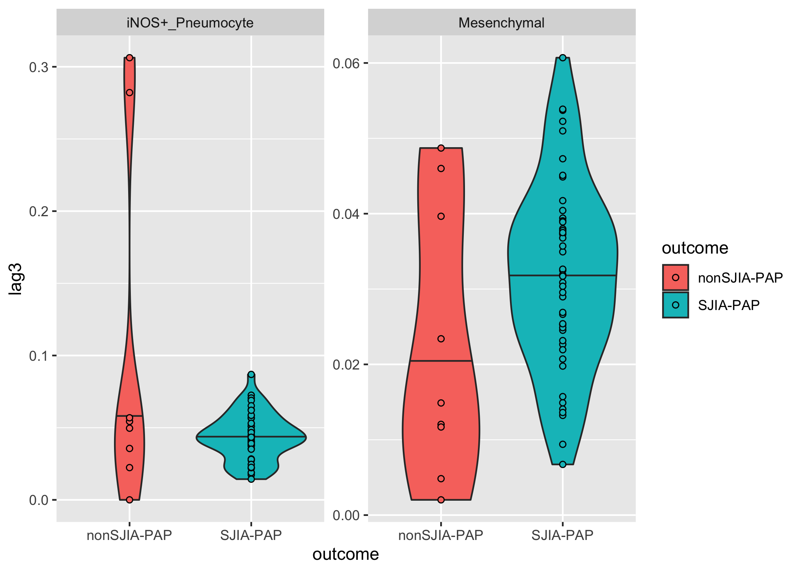

Aim 1 Differential Discovery Analysis
================

-   [1. Setup](#1-setup)
-   [2. Read in data](#2-read-in-data)
-   [3. Pre-process data](#3-pre-process-data)
-   [4. Basic data summary](#4-basic-data-summary)
    -   [Number of unique FOVs in each
        condition](#number-of-unique-fovs-in-each-condition)
    -   [Number of unique patients in each
        condition](#number-of-unique-patients-in-each-condition)
    -   [Number of unique cells in each
        condition](#number-of-unique-cells-in-each-condition)
    -   [Number of cells for each
        patient](#number-of-cells-for-each-patient)
    -   [Number of cells in each FOV](#number-of-cells-in-each-fov)
-   [5. Differential Abundance Analysis - between
    patients](#5-differential-abundance-analysis---between-patients)
    -   [PAP vs. non-PAP](#pap-vs-non-pap)
    -   [SJIA-PAP vs. Controls](#sjia-pap-vs-controls)
    -   [SJIA-PAP vs. nonSJIA-PAP](#sjia-pap-vs-nonsjia-pap)
    -   [nonSJIA-PAP vs. Controls](#nonsjia-pap-vs-controls)
    -   [Visualization](#visualization)
-   [6. Differential Abundance Analysis - within
    patients](#6-differential-abundance-analysis---within-patients)
    -   [Processing](#processing)
    -   [Statistical analysis](#statistical-analysis)
    -   [Visualization](#visualization-1)
-   [7. Differential Expression Analysis - between
    patients](#7-differential-expression-analysis---between-patients)
    -   [PAP vs. non-PAP](#pap-vs-non-pap-1)
    -   [SJIA-PAP vs. Controls](#sjia-pap-vs-controls-1)
    -   [SJIA-PAP vs. nonSJIA-PAP](#sjia-pap-vs-nonsjia-pap-1)
    -   [nonSJIA-PAP vs. Controls](#nonsjia-pap-vs-controls-1)
    -   [Visualization](#visualization-2)
-   [8. Differential Expression Analysis - within
    patients](#8-differential-expression-analysis---within-patients)
-   [9. Spatial Analysis](#9-spatial-analysis)
    -   [Annotate cells](#annotate-cells)
    -   [DAA](#daa)
    -   [DEA](#dea)

# 1. Setup

``` r
# libraries
library(diffcyt)
library(tidyverse)
library(tidymodels)
library(lme4)

# source utils
source('~/GitHub/classes/BIOMEDIN_212/r_scripts/pap_utils.R', echo = FALSE)

# paths 
data_path <- 
  file.path("~", "GitHub", "classes", "BIOMEDIN_212", "data-raw", "cell_table.csv")

metadata_path <- 
  file.path(
    "~", "GitHub", "classes", 
    "BIOMEDIN_212", "data-raw", "fov_labels.csv"
  )

surfactant_path <- 
  file.path(
    "~", "GitHub", "classes", 
    "BIOMEDIN_212", "data-raw", "surfactant_masks"
  )

# globals
healthy_fovs_in_pap_patients <- 
  c(9, 15, 20, 29, 40)

functional_markers <- 
   c(
     "cd11c", "cd123", "cd14",
     "cd16", "cd163", "cd20", 
     "cd206", "cd209", "cd3", 
     "cd31", "cd4", "cd45", 
     "cd45ro", "cd57", "cd68", 
     "cd8", "calprotectin", 
     "epox", "foxp3", 
     "grz_b", "h3k27me3", "h3k9ac", 
     "hh3", "hla_dr", "ho_1", 
     "ido", "if_ng", "ki67", 
     "lag3", "mmp9", 
     "na_kat_pase", "pd1", "pan_ck", 
     "sma", "si", "tim3",
     "tryptase", "vim", 
     "i_nos", "p_s6"
   )
```

<div style="page-break-before: always;" />

# 2. Read in data

``` r
# metadata 
metadata <- 
  metadata_path %>% 
  read_csv() %>% 
  rename(fov_id = point) %>% 
  janitor::clean_names()

# mibi data
mibi_data <- 
  data_path %>% 
  read_csv() %>% 
  rename(
    fov_id = point, 
    cell_id = label, 
    cluster_id = pixelfreq_hclust_cap,
    cluster_name = name, 
    centroid_x = `centroid-0`, 
    centroid_y = `centroid-1`
  ) %>% 
  janitor::clean_names()

# surfactant data
surf_data <- 
  tibble(
    filenames = 
      surfactant_path %>% 
      list.files(), 
    paths = 
      surfactant_path %>% 
      list.files(full.names = TRUE), 
    data = map(.x = paths, .f = pap_read_tif)
  )

surf_data <- 
  surf_data %>% 
  unnest(cols = data) %>% 
  transmute(
    fov_id = str_extract(filenames, pattern = "[:digit:]+"), 
    x, 
    y, 
    values
  )
```

<div style="page-break-before: always;" />

# 3. Pre-process data

``` r
# join the mibi single-cell data with the FOV metadata
mibi_data <- 
  mibi_data %>% 
  left_join(metadata)

# count how many cells there are in each FOV type
mibi_data %>% 
  count(category)
```

    ## # A tibble: 4 x 2
    ##   category        n
    ##   <chr>       <int>
    ## 1 nonSJIA-PAP 10584
    ## 2 Normal       4987
    ## 3 Pneumonia    6161
    ## 4 SJIA-PAP    57324

Because of our limited sample size, we more or less have to combine the
“Normal” and “Pneumonia” category FOVs into a single category
(“Control”). However, we should acknowledge that these two controls are
not created equal - in fact, if we perform a simple t-test between the
Pneumonia and Normal patient FOVs’ proportion of each our immune cell
clusters, we can see that there are significant differences (at the
level of p = 0.05) even after Benjamini-Hochberg adjustment.

``` r
cancer_pneumonia_counts <- 
  mibi_data %>% 
  filter(category %in% c("Pneumonia", "Normal")) %>% 
  mutate(cluster_name = as.factor(cluster_name)) %>% 
  count(patient_id, fov_id, category, cluster_name, .drop = FALSE) %>% 
  group_by(fov_id) %>% 
  mutate(prop = n / sum(n))

t_tests <- 
  cancer_pneumonia_counts %>% 
  group_by(cluster_name) %>% 
  nest() %>% 
  mutate(
    p_value =
      map_dbl(
        .x = data, 
        .f = ~ 
          t.test(
            x = 
              .x %>% 
              dplyr::filter(patient_id == 13) %>% 
              pull(prop), 
            y = 
              .x %>% 
              dplyr::filter(patient_id == 14) %>% 
              pull(prop)
          ) %>% 
          tidy() %>% 
          pull(p.value)
      ) %>% 
      p.adjust(method = "BH")
  )

t_tests %>% 
  select(-data) %>% 
  arrange(p_value) %>% 
  mutate(significant = if_else(p_value < 0.05, "*", "")) %>% 
  knitr::kable()
```

| cluster\_name      |  p\_value | significant |
|:-------------------|----------:|:------------|
| Mast\_cell         | 0.0024518 | \*          |
| Lung\_Epithelium   | 0.0042509 | \*          |
| CD57+\_CD8+\_Tcell | 0.0129929 | \*          |
| M2\_Mac            | 0.0230855 | \*          |
| Eosinophil         | 0.0341076 | \*          |
| Endothelial        | 0.0561127 |             |
| CD8+\_Tcell        | 0.0632200 |             |
| CD209+\_Mac        | 0.0735467 |             |
| iNOS+\_Pneumocyte  | 0.1045573 |             |
| CD16+\_ImmuneOther | 0.1383749 |             |
| Fibroblast         | 0.1780802 |             |
| CD11c+\_mDC        | 0.2475057 |             |
| Neutrophil         | 0.2509420 |             |
| Bcell              | 0.2793292 |             |
| iNOS+\_Mac         | 0.5925798 |             |
| CD57+\_ImmuneOther | 0.6663467 |             |
| CD4+\_Tcell        | 0.7789749 |             |
| Mesenchymal        | 0.9513561 |             |
| Treg               | 0.9617596 |             |
| CD14+\_Mono        | 0.9904512 |             |

``` r
cluster_order <- 
  t_tests %>% 
  arrange(p_value) %>% 
  pull(cluster_name) %>% 
  as.character()

sig_clusters <- 
  t_tests %>% 
  filter(p_value < 0.05) %>% 
  pull(cluster_name) %>% 
  as.character()

cancer_pneumonia_counts %>% 
  mutate(cluster_name = factor(cluster_name, levels = cluster_order)) %>% 
  filter(cluster_name %in% sig_clusters) %>% 
  ggplot(aes(y = prop, x = category, fill = category)) + 
  geom_violin() + 
  geom_jitter(shape = 21, width = 0.1) + 
  facet_wrap(facets = vars(cluster_name), scales = "free") + 
  labs(
    subtitle = "Differentially abundant clusters in our 2 control samples",
    x = NULL, 
    y = "Proportion of cells in a FOV in a cluster", 
    fill = NULL, 
    caption = "Each point represents an FOV;\nall means are significantly different at p = 0.05"
  )
```

<!-- -->

Keeping this in mind, we proceed with annotating the `outcome` variable
such that the pneumonia sample and cancer sample are treated equally as
“controls” (we would be relatively underpowered otherwise in later
comparisons, although this lumping is sub-optimal).

``` r
mibi_data <- 
  mibi_data %>% 
  mutate(
    outcome = 
      if_else(category %in% c("Normal", "Pneumonia"), "Control", category)
  )
```

<div style="page-break-before: always;" />

# 4. Basic data summary

## Number of unique FOVs in each condition

``` r
mibi_data %>% 
  distinct(outcome, fov_id) %>% 
  count(outcome, name = "num_fovs") %>% 
  arrange(-num_fovs)
```

    ## # A tibble: 3 x 2
    ##   outcome     num_fovs
    ##   <chr>          <int>
    ## 1 SJIA-PAP          48
    ## 2 Control           10
    ## 3 nonSJIA-PAP        9

## Number of unique patients in each condition

``` r
mibi_data %>% 
  distinct(outcome, patient_id) %>% 
  count(outcome, name = "num_patients") %>% 
  arrange(-num_patients)
```

    ## # A tibble: 3 x 2
    ##   outcome     num_patients
    ##   <chr>              <int>
    ## 1 SJIA-PAP              12
    ## 2 Control                2
    ## 3 nonSJIA-PAP            2

## Number of unique cells in each condition

``` r
mibi_data %>% 
  count(outcome, name = "num_cells") %>% 
  arrange(-num_cells)
```

    ## # A tibble: 3 x 2
    ##   outcome     num_cells
    ##   <chr>           <int>
    ## 1 SJIA-PAP        57324
    ## 2 Control         11148
    ## 3 nonSJIA-PAP     10584

## Number of cells for each patient

``` r
mibi_data %>% 
  count(patient_id, name = "num_cells") %>% 
  arrange(-num_cells)
```

    ## # A tibble: 16 x 2
    ##    patient_id num_cells
    ##         <dbl>     <int>
    ##  1         11      8710
    ##  2         16      7705
    ##  3         13      6161
    ##  4         10      5811
    ##  5          9      5294
    ##  6          8      5061
    ##  7         14      4987
    ##  8          4      4972
    ##  9         12      4935
    ## 10          2      4590
    ## 11          5      4140
    ## 12          7      4115
    ## 13          3      4025
    ## 14          6      3433
    ## 15         15      2879
    ## 16          1      2238

## Number of cells in each FOV

``` r
mibi_data %>% 
  count(fov_id, name = "num_cells") %>% 
  arrange(-num_cells)
```

    ## # A tibble: 67 x 2
    ##    fov_id num_cells
    ##     <dbl>     <int>
    ##  1     14      2634
    ##  2     44      2341
    ##  3     12      2019
    ##  4     32      1924
    ##  5     43      1891
    ##  6      1      1885
    ##  7     25      1759
    ##  8     26      1754
    ##  9     49      1752
    ## 10     38      1726
    ## # … with 57 more rows

<div style="page-break-before: always;" />

# 5. Differential Abundance Analysis - between patients

In Aim 1, we proposed a differential abundance analysis of different
immune cell subtypes (represented by the column `cluster_name` in
`mibi_data`) across different types of MIBI images. The first of these
analyses is to compare the abundance of each immune cell subtype between
independent patients, each of which has either SJIA-PAP, PAP caused by
something other than SJIA (nonSJIA-PAP), pneumonia, or lung cancer
(which we code as “Normal” in `mibi_data`). We combine the last two
conditions into the “control” category because neither of them have PAP,
so they make as much sense as any sample we have access to to form our
basis of comparison.

To perform our differential abundance analysis, we use the statistical
framework proposed in the
[{{diffcyt}}](https://www.nature.com/articles/s42003-019-0415-5)
framework.

Specifically, we use generalized linear mixed models (GLMMs) to test for
differences in cluster abundance and cluster marker expression. The
benefit of using mixed-models in this context is that, unlike more
traditional differential abundance/expression testing tools commonly
applied to cytometry data like
[CITRUS](https://www.ncbi.nlm.nih.gov/pmc/articles/PMC4084463/), GLMMs
can account for complex experimental designs such as paired or block
designs with known covariates representing batch effects or
individual-to-individual variation. In the case of the present study,
using random effects to model the variance in cluster abundance and
marker expression that arises from random variation between individual
patients (from whom we draw multiple FOVs), we can more reliably detect
differences attributable solely to the effect of the `outcome` variable.

To do this, we can use the `{diffcyt}` R package to test for
differential abundance of clusters across different levels of `outcome`
using binomial regression. For each cluster, we can fit a binomial
regression model in which we model the log-odds (and thus indirectly the
proportion of cells in a given cluster) of each cluster in a given
patient *i* and a given FOV *j* *p*<sub>*i**j*</sub> according to the
following equation:

$$
logit(p\_{ij}) = log(\\frac{p\_{ij}}{1 - p\_{ij}}) = \\beta\_0 + \\alpha\_i + \\beta\_1 X\_{j}
$$

In the equation above, we use the following definitions:

-   *p*<sub>*i**j*</sub>: The proportion of cells in a given cluster in
    patient *i* and FOV *j*
-   *α*<sub>*i*</sub>: A random intercept for each patient *i* in which
    *α*<sub>*i*</sub> \~ *N*(0, *σ*), where *σ* is estimated during
    model fitting.
-   *X*<sub>*j*</sub>: an indicator variable representing whether or not
    an FOV j was taken from an SJIA-PAP patient (1 if yes, 0 otherwise).
    Depending on which comparisons we’re making, what *X*<sub>*j*</sub>
    stands for can change (but it always represents which `outcome` FOV
    j has been annotated with).
-   All *β*’s are linear model parameters optimized during model
    fitting.

Using the above setup, we can apply null-hypothesis significance testing
to *β*<sub>1</sub> (under the null hypothesis that *β*<sub>1</sub> = 0):
if *β*<sub>1</sub> is significantly different from 0 in the model, we
can state that the proportion of cells in our cluster differs
significantly between the levels of `outcome` we’re investigating while
controlling for individual-to-individual variation.

## PAP vs. non-PAP

Using this framework, we can first compare the PAP samples (either
SJIA-PAP or nonSJIA-PAP) to the control samples in our cohort. Note that
we set a filter so that clusters that have fewer than 3 cells in 5
samples are removed from the analysis, as clusters with this few cells
can’t be used to estimate reliable proportions for a cell subtype’s
relative abundance in the sample it was collected from.

``` r
pap_daa <- 
  mibi_data %>% 
  select(fov_id, cluster_name, outcome, patient_id, any_of(functional_markers)) %>%
  mutate(outcome = if_else(outcome %in% c("SJIA-PAP", "nonSJIA-PAP"), "PAP", outcome)) %>%
  pap_perform_daa(
    data_tibble = ., 
    sample_col = fov_id, 
    cluster_col = cluster_name, 
    fixed_effect_cols = outcome,
    random_effect_cols = c(patient_id), 
    include_observation_level_random_effects = FALSE
  )

pap_daa$da_results %>% 
  topTable(all = TRUE) %>% 
  as_tibble() %>% 
  arrange(p_adj) %>% 
  mutate(significance = if_else(p_adj < 0.05, "*", "")) %>% 
  knitr::kable()
```

| cluster\_id        |    p\_val |    p\_adj | significance |
|:-------------------|----------:|----------:|:-------------|
| CD209+\_Mac        | 0.0284889 | 0.2848894 |              |
| Neutrophil         | 0.0149365 | 0.2848894 |              |
| Bcell              | 0.3262681 | 0.7449216 |              |
| CD11c+\_mDC        | 0.1519862 | 0.7449216 |              |
| CD14+\_Mono        | 0.4472275 | 0.7449216 |              |
| CD57+\_CD8+\_Tcell | 0.4812898 | 0.7449216 |              |
| CD8+\_Tcell        | 0.2688716 | 0.7449216 |              |
| Endothelial        | 0.2369884 | 0.7449216 |              |
| Fibroblast         | 0.2432184 | 0.7449216 |              |
| iNOS+\_Mac         | 0.1652710 | 0.7449216 |              |
| iNOS+\_Pneumocyte  | 0.4402886 | 0.7449216 |              |
| Mesenchymal        | 0.4841990 | 0.7449216 |              |
| Treg               | 0.3633710 | 0.7449216 |              |
| CD16+\_ImmuneOther | 0.5616607 | 0.8023724 |              |
| CD4+\_Tcell        | 0.6354191 | 0.8074845 |              |
| CD57+\_ImmuneOther | 0.6459876 | 0.8074845 |              |
| Eosinophil         | 0.8001735 | 0.9413806 |              |
| Lung\_Epithelium   | 0.9541837 | 0.9541837 |              |
| M2\_Mac            | 0.9149582 | 0.9541837 |              |
| Mast\_cell         | 0.8741013 | 0.9541837 |              |
| Giant\_cell        |        NA |        NA | NA           |

From these results, we can see that, when taking individual
random-effects into account, there are no statistically significant
differentially abundant clusters between PAP and non-PAP samples (at
least at the level of power we have available to us in this study).

## SJIA-PAP vs. Controls

The second comparison we can run is between SJIA-PAP samples and control
samples.

``` r
daa_sjia_pap_vs_controls <- 
  mibi_data %>% 
  select(fov_id, cluster_name, outcome, patient_id, any_of(functional_markers)) %>% 
  filter(outcome != "nonSJIA-PAP") %>% 
  pap_perform_daa(
    data_tibble = ., 
    sample_col = fov_id, 
    cluster_col = cluster_name, 
    fixed_effect_cols = outcome,
    random_effect_cols = c(patient_id), 
    include_observation_level_random_effects = FALSE
  )

daa_sjia_pap_vs_controls$da_results %>% 
  topTable(all = TRUE) %>% 
  as_tibble() %>% 
  arrange(p_adj) %>% 
  mutate(significance = if_else(p_adj < 0.05, "*", "")) %>% 
  knitr::kable()
```

| cluster\_id        |    p\_val |    p\_adj | significance |
|:-------------------|----------:|----------:|:-------------|
| Neutrophil         | 0.0000533 | 0.0010658 | \*           |
| CD11c+\_mDC        | 0.1296667 | 0.6439611 |              |
| CD14+\_Mono        | 0.3199656 | 0.6439611 |              |
| CD209+\_Mac        | 0.1100076 | 0.6439611 |              |
| CD8+\_Tcell        | 0.2086889 | 0.6439611 |              |
| Endothelial        | 0.2859825 | 0.6439611 |              |
| Fibroblast         | 0.2608195 | 0.6439611 |              |
| iNOS+\_Mac         | 0.1769249 | 0.6439611 |              |
| Mesenchymal        | 0.3219806 | 0.6439611 |              |
| Treg               | 0.2466686 | 0.6439611 |              |
| CD57+\_CD8+\_Tcell | 0.3558237 | 0.6469522 |              |
| Bcell              | 0.4690123 | 0.7785946 |              |
| CD4+\_Tcell        | 0.5060865 | 0.7785946 |              |
| CD16+\_ImmuneOther | 0.7383804 | 0.9488822 |              |
| CD57+\_ImmuneOther | 0.8849907 | 0.9488822 |              |
| Eosinophil         | 0.9014381 | 0.9488822 |              |
| Lung\_Epithelium   | 0.6759856 | 0.9488822 |              |
| M2\_Mac            | 0.8072448 | 0.9488822 |              |
| Mast\_cell         | 0.7877623 | 0.9488822 |              |
| iNOS+\_Pneumocyte  | 0.9523543 | 0.9523543 |              |

In these results, we can see that neutrophils are differentially
abundant in SJIA-PAP and control samples.

## SJIA-PAP vs. nonSJIA-PAP

The third comparison we can run is between SJIA-PAP and nonSJIA-PAP
samples.

``` r
daa_sjia_pap_vs_nonsjia_pap <- 
  mibi_data %>% 
  select(fov_id, cluster_name, outcome, patient_id, any_of(functional_markers)) %>% 
  filter(outcome != "Control") %>% 
  pap_perform_daa(
    data_tibble = ., 
    sample_col = fov_id, 
    cluster_col = cluster_name, 
    fixed_effect_cols = outcome,
    random_effect_cols = c(patient_id), 
    include_observation_level_random_effects = FALSE
  )

daa_sjia_pap_vs_nonsjia_pap$da_results %>% 
  topTable(all = TRUE) %>% 
  as_tibble() %>% 
  arrange(p_adj) %>% 
  mutate(significance = if_else(p_adj < 0.05, "*", "")) %>% 
  knitr::kable()
```

| cluster\_id        |    p\_val |    p\_adj | significance |
|:-------------------|----------:|----------:|:-------------|
| CD209+\_Mac        | 0.1262413 | 0.5950393 |              |
| CD4+\_Tcell        | 0.0964778 | 0.5950393 |              |
| CD57+\_ImmuneOther | 0.0777235 | 0.5950393 |              |
| M2\_Mac            | 0.1487598 | 0.5950393 |              |
| Mesenchymal        | 0.0569134 | 0.5950393 |              |
| Fibroblast         | 0.1843179 | 0.6143931 |              |
| CD16+\_ImmuneOther | 0.2473755 | 0.6184387 |              |
| Treg               | 0.2167738 | 0.6184387 |              |
| Neutrophil         | 0.3575358 | 0.7945239 |              |
| Bcell              | 0.4944349 | 0.8240582 |              |
| CD57+\_CD8+\_Tcell | 0.4888039 | 0.8240582 |              |
| iNOS+\_Pneumocyte  | 0.4535573 | 0.8240582 |              |
| CD11c+\_mDC        | 0.6615094 | 0.8268868 |              |
| CD8+\_Tcell        | 0.6364111 | 0.8268868 |              |
| Endothelial        | 0.5728799 | 0.8268868 |              |
| Eosinophil         | 0.6216371 | 0.8268868 |              |
| Lung\_Epithelium   | 0.7370731 | 0.8671449 |              |
| CD14+\_Mono        | 0.9862027 | 0.9869697 |              |
| iNOS+\_Mac         | 0.8927271 | 0.9869697 |              |
| Mast\_cell         | 0.9869697 | 0.9869697 |              |
| Giant\_cell        |        NA |        NA | NA           |

And once again we can see that there are no differentially abundant
clusters between these sample types.

## nonSJIA-PAP vs. Controls

The final between-patients comparison we can run is between nonSJIA-PAP
samples and control samples.

``` r
daa_control_vs_nonsjia_pap <- 
  mibi_data %>% 
  select(fov_id, cluster_name, outcome, patient_id, any_of(functional_markers)) %>% 
  filter(outcome != "SJIA-PAP") %>% 
  pap_perform_daa(
    data_tibble = ., 
    sample_col = fov_id, 
    cluster_col = cluster_name, 
    fixed_effect_cols = outcome,
    random_effect_cols = c(patient_id), 
    include_observation_level_random_effects = FALSE
  )

daa_control_vs_nonsjia_pap$da_results %>% 
  topTable(all = TRUE) %>% 
  as_tibble() %>% 
  arrange(p_adj) %>% 
  mutate(significance = if_else(p_adj < 0.05, "*", "")) %>% 
  knitr::kable()
```

| cluster\_id        |    p\_val |    p\_adj | significance |
|:-------------------|----------:|----------:|:-------------|
| iNOS+\_Pneumocyte  | 0.0002079 | 0.0041581 | \*           |
| CD14+\_Mono        | 0.0076753 | 0.0487124 | \*           |
| Endothelial        | 0.0097425 | 0.0487124 | \*           |
| iNOS+\_Mac         | 0.0065791 | 0.0487124 | \*           |
| CD57+\_ImmuneOther | 0.0125417 | 0.0501667 |              |
| CD16+\_ImmuneOther | 0.0346300 | 0.1154335 |              |
| Bcell              | 0.1194941 | 0.2830523 |              |
| Fibroblast         | 0.1273735 | 0.2830523 |              |
| Treg               | 0.1219037 | 0.2830523 |              |
| CD11c+\_mDC        | 0.3118498 | 0.5669996 |              |
| Lung\_Epithelium   | 0.3053443 | 0.5669996 |              |
| Neutrophil         | 0.3766638 | 0.6277730 |              |
| Eosinophil         | 0.4573792 | 0.6533988 |              |
| M2\_Mac            | 0.4476823 | 0.6533988 |              |
| Mesenchymal        | 0.5003182 | 0.6670909 |              |
| CD57+\_CD8+\_Tcell | 0.5506301 | 0.6882876 |              |
| CD4+\_Tcell        | 0.6183913 | 0.7275192 |              |
| CD209+\_Mac        | 0.6729049 | 0.7476721 |              |
| CD8+\_Tcell        | 0.7636266 | 0.7636266 |              |
| Mast\_cell         | 0.7446099 | 0.7636266 |              |
| Giant\_cell        |        NA |        NA | NA           |

And in this case we can see that there are several cell subtypes that
are differentially abundant (pneumocytes, monocytes, endothelial cells,
and iNOS+ Macrophages).

## Visualization

``` r
interesting_clusters <- 
  c("Neutrophil", "CD209+_Mac", "CD14+_Mono", "iNOS+_Mac")

mibi_data %>% 
  count(fov_id, cluster_name, patient_id, outcome) %>% 
  group_by(fov_id) %>% 
  mutate(
    total_cells = sum(n), 
    prop = n / total_cells
  ) %>% 
  filter(cluster_name %in% interesting_clusters) %>% 
  #group_by(patient_id, cluster_name, outcome) %>% 
  #summarize(prop = mean(prop)) %>% 
  ggplot(aes(x = outcome, y = prop, fill = outcome)) + 
  geom_violin(draw_quantiles = 0.5) + 
  geom_point(shape = 21, position = position_dodge(width = 0.3)) + 
  facet_wrap(facets = vars(cluster_name), scales = "free")
```

<!-- -->

From these plots, we can see that the differences between individual
FOVS (even for these populations, which are the ones that came up in the
analysis) are not very striking. In general, we might conclude that
SJIA-PAP samples have slightly fewer neutrophils on average than control
samples, but this seems largely driven by the outlier in the controls
FOVs. To me, it looks like most of these differences are unreliable
because of the low sample size. If you want to get into the realm of
p-hacking, you could simply treat all the FOVs from a given patient as
being entirely independent of one another (and I imagine that there are
some studies that do this), but that’s not an approach that I could
endorse.

<div style="page-break-before: always;" />

# 6. Differential Abundance Analysis - within patients

In addition to the between-patients comparisons, we can also run another
set of comparisons that leverages a within-subjects design to increase
statistical power. As it turns out, for several of our SJIA-PAP samples,
one of the FOVs collected was annotated as a “healthy” section of tissue
relative to the others (which had more of the hallmark histopathological
features of SJIA-PAP). We can compare the abundance of each of our
immune cell subpopulations within the same patients by comparing the
“healthy” FOV to the other FOVs taken from the same patient. In this
case the GLMM we’re using is the following:

$$
logit(p\_{ij}) = log(\\frac{p\_{ij}}{1 - p\_{ij}}) = \\beta\_0 + \\alpha\_i + \\beta\_1 X\_{j\_{diseased}}, 
$$
where *X*<sub>*j*<sub>*d**i**s**e**a**s**e**d*</sub></sub> is an
indicator variable representing if FOV j comes from a “diseased” area of
the SJIA-PAP tissue or not (1 if yes; 0 otherwise). Thus,
*β*<sub>1</sub> represents the difference in log-odds for a given cell
subtype between the diseased and non-diseased FOVs within a given
patients (controlling for patient-to-patient variability, which is
represented by *α*<sub>*i*</sub>).

## Processing

``` r
# find patients who had at least one "healthy" FOV
interesting_patients <- 
  mibi_data %>% 
  filter(fov_id %in% healthy_fovs_in_pap_patients) %>% 
  distinct(patient_id) %>% 
  pull(patient_id)

interesting_patients
```

    ## [1] 16  8  9 11  1

``` r
# filter only the patients with "healthy-looking" FOVs from the full dataset
paired_patients <- 
  mibi_data %>% 
  #filter(patient_id %in% interesting_patients) %>% 
  # annotate FOVs that are "healthy-looking" according to our pathologist
  mutate(
    fov_condition = 
           if_else(fov_id %in% healthy_fovs_in_pap_patients, "healthy", "pap")
  )
```

## Statistical analysis

``` r
paired_daa_results <- 
  paired_patients %>% 
  filter(outcome == "SJIA-PAP") %>% 
  pap_perform_daa(
    data_tibble = ., 
    sample_col = fov_id, 
    cluster_col = cluster_name, 
    fixed_effect_cols = fov_condition, 
    random_effect_cols = patient_id, 
    include_observation_level_random_effects = FALSE
  )

paired_daa_results %>% 
  pluck("da_results") %>% 
  topTable(all = TRUE) %>% 
  as_tibble() %>% 
  mutate(significant = if_else(p_adj < 0.05, "*", "")) %>% 
  arrange(p_adj) %>%  
  knitr::kable()
```

| cluster\_id        |    p\_val |    p\_adj | significant |
|:-------------------|----------:|----------:|:------------|
| Bcell              | 0.0000000 | 0.0000000 | \*          |
| Neutrophil         | 0.0000000 | 0.0000000 | \*          |
| CD4+\_Tcell        | 0.0000000 | 0.0000000 | \*          |
| Fibroblast         | 0.0000000 | 0.0000000 | \*          |
| M2\_Mac            | 0.0000052 | 0.0000206 | \*          |
| Treg               | 0.0000354 | 0.0001181 | \*          |
| Eosinophil         | 0.0000445 | 0.0001246 | \*          |
| Lung\_Epithelium   | 0.0000498 | 0.0001246 | \*          |
| Mast\_cell         | 0.0007133 | 0.0015851 | \*          |
| CD209+\_Mac        | 0.0030874 | 0.0061748 | \*          |
| CD57+\_CD8+\_Tcell | 0.0218511 | 0.0397293 | \*          |
| CD57+\_ImmuneOther | 0.0258245 | 0.0397300 | \*          |
| iNOS+\_Pneumocyte  | 0.0251787 | 0.0397300 | \*          |
| iNOS+\_Mac         | 0.0420420 | 0.0600600 |             |
| Endothelial        | 0.0630342 | 0.0840457 |             |
| Mesenchymal        | 0.0711934 | 0.0889917 |             |
| CD16+\_ImmuneOther | 0.3056815 | 0.3596253 |             |
| CD8+\_Tcell        | 0.3353813 | 0.3726459 |             |
| CD11c+\_mDC        | 0.9907574 | 0.9907574 |             |
| CD14+\_Mono        | 0.9560004 | 0.9907574 |             |

From these results, we can see that there are several immune cell
subtypes that, when using a paired design, we find are enriched in parts
of the SJIA-PAP lung that actually show histopathological signs of
disease compared to paired parts of the SJIA-PAP lung that do not show
histopathological signs of disease.

We can visualize these differences below.

## Visualization

``` r
paired_p_values <- 
  paired_daa_results %>% 
  pluck("da_results") %>% 
  topTable(all = TRUE) %>% 
  as_tibble() %>% 
  mutate(
    significant = if_else(p_adj < 0.05, "*", ""), 
    new_cluster_name = if_else(significant == "*", str_c(cluster_id, "*"), as.character(cluster_id))
  ) %>% 
  arrange(p_adj) %>% 
  rename(cluster_name = cluster_id)

sig_clusters <- 
  paired_p_values %>% 
  filter(significant == "*") %>% 
  pull(cluster_name)

# calculate the number of fovs used for each patient in each "condition"
num_fov_tibble <- 
  paired_patients %>% 
  distinct(fov_id, patient_id, fov_condition) %>% 
  count(patient_id, fov_condition, name = "num_fovs")

paired_plot_data <- 
  paired_patients %>% 
  mutate(
    cluster_name = 
      factor(cluster_name, levels = pull(paired_p_values, cluster_name)) , 
  ) %>% 
  count(cluster_name, patient_id, fov_id, fov_condition, .drop = FALSE) %>%
  group_by(fov_id) %>% 
  mutate(
    total_fov_cells = sum(n),
    prop = n / total_fov_cells
  ) %>% 
  # ungroup() %>% 
  # group_by(fov_condition, patient_id, cluster_name) %>% 
  # summarize(
  #   sd = sd(prop, na.rm = TRUE),
  #   prop = mean(prop, na.rm = TRUE), 
  # ) %>% 
  # drop_na(cluster_name) %>% 
  # ungroup() %>% 
  complete(patient_id, fov_id, fov_condition, cluster_name, fill = list(prop = 0))
  # left_join(num_fov_tibble) %>% 
  # mutate(
  #   sem = sd / sqrt(num_fovs)
  # )
```

``` r
paired_plot_data %>% 
  left_join(paired_p_values) %>% 
  mutate(new_cluster_name = fct_reorder(new_cluster_name, p_adj)) %>%  
  drop_na(new_cluster_name) %>% 
  ggplot(aes(y = prop, x = fov_condition, fill = fov_condition)) + 
  geom_violin(draw_quantiles = 0.5) + 
  # geom_line(aes(group = patient_id), color = "black") + 
  # geom_errorbar(
  #   aes(x = fov_condition, y = prop, ymin = prop - sem, ymax = prop + sem),
  #   width = 0.2, 
  #   alpha = 0.7
  # ) +
  geom_jitter(shape = 21, size = 1.5, width = 0.03) + 
  facet_wrap(facets = vars(new_cluster_name), scales = "free", ncol = 4) + 
  labs(
    subtitle = "Cluster proportions in healthy and diseased regions of SJIA-PAP lung", 
    x = NULL, 
    y = "Proportion of cells", 
    caption = "Cluster names with *'s indicate significance at p = 0.05;\n dots indicate individual FOVs", 
    fill = NULL
  )
```

<!-- -->

``` r
paired_plot_data %>% 
  left_join(paired_p_values) %>% 
  mutate(new_cluster_name = fct_reorder(new_cluster_name, p_adj)) %>%  
  drop_na(new_cluster_name) %>% 
  select(patient_id, fov_condition, new_cluster_name, prop, p_adj) %>% 
  pivot_wider(
    names_from = fov_condition, 
    values_from = prop
  ) %>% 
  group_by(new_cluster_name) %>% 
  summarize(across(c(healthy, pap), mean, na.rm = TRUE)) %>% 
  mutate(
    fc = pap / healthy, 
    log2_fc = log(fc, base = 2)
  ) %>% 
  left_join(paired_p_values) %>% 
  mutate(
    neg_log_p_val = -log(p_adj),
    cluster_type = 
      case_when(
        p_adj > 0.05 ~ "Not significant", 
        fc > 1       ~ "Increased", 
        fc < 1       ~ "Decreased"
      )
  ) %>% 
  ggplot(aes(x = log2_fc, y = neg_log_p_val, fill = cluster_type)) + 
  geom_hline(yintercept = -log(0.05), color = "black", linetype = "dashed") + 
  geom_vline(xintercept = 0, color = "black", linetype = "dashed") +
  geom_point(shape = 21, size = 2.5) + 
  ggrepel::geom_label_repel(
    aes(label = str_replace_all(new_cluster_name, "_", " ")), 
    size = 2.5, 
    color = "black", 
    show.legend = FALSE
  ) + 
  scale_y_continuous(limits = c(NA, 20), oob = scales::oob_squish_any) + 
  labs(
    subtitle = "Differentially abundant clusters in diseased vs. non-diseased regions of SJIA-PAP lung", 
    x = "log2FC", 
    y = "-log(p-value)",
    fill = NULL, 
    caption = "Increased/decreased refer to abundance of clusters in\ndiseased regions relative to healthy regions of lung tissue"
  )
```

<!-- -->

<div style="page-break-before: always;" />

# 7. Differential Expression Analysis - between patients

We can use a similar procedure as above to test for differences in mean
marker expression across clusters by fitting a linear regression model
(thus, an LMM, not a GLMM) for each cluster/marker pair. For this, we
implicitly assume the that mean marker expression values in each cluster
are distributed normally among patients (which is a large assumption
even though this method is state-of-the-art in the cytometry community).
Thus, for differential marker expression, we use the following equation
to predict the mean expression value *y*<sub>*i**j*</sub> for a given
cluster/marker pair in patient **i** and sample **j**:

*y*<sub>*i**j*</sub> = *β*<sub>0</sub> + *α*<sub>*i*</sub> + *β*<sub>1</sub>*X*<sub>*j*</sub>,

where each of the variables on the right-hand side of the equation are
defined as in section 5. Due to our small sample size, we use the
[{{limma}}](https://academic.oup.com/nar/article/43/7/e47/2414268)
package’s parametric empirical Bayes method of estimating the variance
for each marker being analyzed - this method allows for the sharing of
variability information across all markers (and thereby an increase in
statistical power in rarer cell types and less highly-expressed
markers).

Thus, a linear model can be fit for each marker-cluster pair across all
FOVs, and the significance of *β*<sub>1</sub> can be tested to indicate
the effect of the `outcome` variable on marker expression in a given
cluster.

## PAP vs. non-PAP

We perform the same comparisons in the same order as in section 5
starting with all PAP vs. non-PAP samples:

``` r
pap_dea <- 
  mibi_data %>% 
  select(fov_id, cluster_name, outcome, patient_id, any_of(functional_markers)) %>%
  mutate(outcome = if_else(outcome %in% c("SJIA-PAP", "nonSJIA-PAP"), "PAP", outcome)) %>% 
  pap_perform_dea(
    data_tibble = ., 
    sample_col = fov_id, 
    cluster_col = cluster_name, 
    fixed_effect_cols = outcome,
    random_effect_col = c(patient_id), 
    min_cells = 5, 
    min_samples = 5 
  )

# only show the top 25 most significant results
pap_dea$de_results %>% 
  topTable(top_n = 25) %>% 
  as_tibble() %>% 
  arrange(p_adj) %>% 
  mutate(significance = if_else(p_adj < 0.05, "*", "")) %>% 
  knitr::kable()
```

| cluster\_id | marker\_id   |    p\_val |    p\_adj | significance |
|:------------|:-------------|----------:|----------:|:-------------|
| CD4+\_Tcell | ho\_1        | 0.0000000 | 0.0000003 | \*           |
| CD8+\_Tcell | ido          | 0.0000000 | 0.0000120 | \*           |
| Treg        | calprotectin | 0.0000001 | 0.0000227 | \*           |
| CD8+\_Tcell | sma          | 0.0000037 | 0.0007343 | \*           |
| Neutrophil  | cd31         | 0.0000072 | 0.0011498 | \*           |
| CD8+\_Tcell | cd45ro       | 0.0000337 | 0.0044886 | \*           |
| Neutrophil  | hh3          | 0.0001206 | 0.0137804 | \*           |
| CD8+\_Tcell | cd14         | 0.0001441 | 0.0144104 | \*           |
| CD8+\_Tcell | cd31         | 0.0004699 | 0.0376558 | \*           |
| Mast\_cell  | calprotectin | 0.0004707 | 0.0376558 | \*           |
| M2\_Mac     | cd31         | 0.0006038 | 0.0439119 | \*           |
| CD14+\_Mono | cd31         | 0.0007405 | 0.0447756 | \*           |
| Neutrophil  | hla\_dr      | 0.0007836 | 0.0447756 | \*           |
| CD8+\_Tcell | vim          | 0.0007542 | 0.0447756 | \*           |
| Neutrophil  | cd45ro       | 0.0014519 | 0.0725940 |              |
| CD11c+\_mDC | hla\_dr      | 0.0013935 | 0.0725940 |              |
| CD4+\_Tcell | cd45ro       | 0.0017349 | 0.0816402 |              |
| iNOS+\_Mac  | vim          | 0.0024281 | 0.1079161 |              |
| Treg        | cd163        | 0.0032848 | 0.1274656 |              |
| Eosinophil  | ido          | 0.0033460 | 0.1274656 |              |
| CD8+\_Tcell | p\_s6        | 0.0032649 | 0.1274656 |              |
| CD4+\_Tcell | calprotectin | 0.0039012 | 0.1300399 |              |
| CD8+\_Tcell | hh3          | 0.0038458 | 0.1300399 |              |
| CD8+\_Tcell | pan\_ck      | 0.0035863 | 0.1300399 |              |
| Bcell       | cd8          | 0.0041655 | 0.1321142 |              |

From these results, we can see that most markers that are differentially
expressed are in different kinds of T-cells and Neutrophils (with mast
cells and M2 macrophages having 1 differentially expressed marker each).

## SJIA-PAP vs. Controls

Now we compare SJIA-PAP samples to control samples:

``` r
dea_sjia_pap_vs_controls <- 
  mibi_data %>% 
  select(fov_id, cluster_name, outcome, patient_id, any_of(functional_markers)) %>%
  filter(outcome != "nonSJIA-PAP") %>% 
  pap_perform_dea(
    data_tibble = ., 
    sample_col = fov_id, 
    cluster_col = cluster_name, 
    fixed_effect_cols = outcome,
    random_effect_col = c(patient_id), 
    min_cells = 5, 
    min_samples = 5
  )

dea_sjia_pap_vs_controls$de_results %>% 
  topTable(top_n = 25) %>% 
  as_tibble() %>% 
  arrange(p_adj) %>% 
  mutate(significance = if_else(p_adj < 0.05, "*", "")) %>% 
  knitr::kable()
```

| cluster\_id | marker\_id   |    p\_val |    p\_adj | significance |
|:------------|:-------------|----------:|----------:|:-------------|
| CD4+\_Tcell | ho\_1        | 0.0000000 | 0.0000040 | \*           |
| CD8+\_Tcell | sma          | 0.0000000 | 0.0000040 | \*           |
| CD4+\_Tcell | calprotectin | 0.0000000 | 0.0000053 | \*           |
| CD8+\_Tcell | ido          | 0.0000007 | 0.0001413 | \*           |
| CD8+\_Tcell | cd45ro       | 0.0000088 | 0.0014110 | \*           |
| Neutrophil  | cd31         | 0.0000346 | 0.0046129 | \*           |
| CD8+\_Tcell | cd14         | 0.0000745 | 0.0085159 | \*           |
| CD8+\_Tcell | cd31         | 0.0001685 | 0.0149745 | \*           |
| Treg        | calprotectin | 0.0001672 | 0.0149745 | \*           |
| Neutrophil  | hla\_dr      | 0.0003534 | 0.0235578 | \*           |
| CD8+\_Tcell | pan\_ck      | 0.0003145 | 0.0235578 | \*           |
| CD8+\_Tcell | vim          | 0.0003497 | 0.0235578 | \*           |
| Neutrophil  | hh3          | 0.0006470 | 0.0398161 | \*           |
| CD8+\_Tcell | cd4          | 0.0013638 | 0.0727353 |              |
| CD4+\_Tcell | cd45ro       | 0.0012871 | 0.0727353 |              |
| CD8+\_Tcell | hh3          | 0.0016627 | 0.0831329 |              |
| CD8+\_Tcell | calprotectin | 0.0026299 | 0.1237621 |              |
| Treg        | cd163        | 0.0043787 | 0.1821522 |              |
| Neutrophil  | cd45ro       | 0.0047842 | 0.1821522 |              |
| Mast\_cell  | calprotectin | 0.0050092 | 0.1821522 |              |
| CD11c+\_mDC | hla\_dr      | 0.0047077 | 0.1821522 |              |
| iNOS+\_Mac  | vim          | 0.0046123 | 0.1821522 |              |
| CD209+\_Mac | hla\_dr      | 0.0052589 | 0.1829181 |              |
| CD11c+\_mDC | h3k27me3     | 0.0060519 | 0.2017299 |              |
| M2\_Mac     | cd31         | 0.0069729 | 0.2147075 |              |

As above, we can see that most marker differences occur in different
kinds of T-cells and neutrophils.

## SJIA-PAP vs. nonSJIA-PAP

Next, we compare SJIA-PAP and nonSJIA-PAP samples:

``` r
dea_sjia_pap_vs_nonsjia_pap <- 
  mibi_data %>% 
  select(fov_id, cluster_name, outcome, patient_id, any_of(functional_markers)) %>%
  filter(outcome != "Control") %>% 
  pap_perform_dea(
    data_tibble = ., 
    sample_col = fov_id, 
    cluster_col = cluster_name, 
    fixed_effect_cols = outcome,
    random_effect_col = c(patient_id), 
    min_cells = 20, 
    min_samples = 10
  )

dea_sjia_pap_vs_nonsjia_pap$de_results %>% 
  topTable(top_n = 25) %>% 
  as_tibble() %>% 
  arrange(p_adj) %>% 
  mutate(significance = if_else(p_adj < 0.05, "*", "")) %>% 
  knitr::kable()
```

| cluster\_id       | marker\_id   |    p\_val |    p\_adj | significance |
|:------------------|:-------------|----------:|----------:|:-------------|
| Mesenchymal       | lag3         | 0.0000161 | 0.0090116 | \*           |
| iNOS+\_Pneumocyte | lag3         | 0.0001722 | 0.0482035 | \*           |
| Mesenchymal       | vim          | 0.0003095 | 0.0577704 |              |
| CD8+\_Tcell       | cd123        | 0.0010664 | 0.0996289 |              |
| CD8+\_Tcell       | lag3         | 0.0008544 | 0.0996289 |              |
| iNOS+\_Pneumocyte | vim          | 0.0010675 | 0.0996289 |              |
| Endothelial       | cd206        | 0.0020487 | 0.1409582 |              |
| CD4+\_Tcell       | calprotectin | 0.0018725 | 0.1409582 |              |
| Endothelial       | ido          | 0.0025171 | 0.1409582 |              |
| Mast\_cell        | vim          | 0.0024047 | 0.1409582 |              |
| CD4+\_Tcell       | cd123        | 0.0046176 | 0.1879792 |              |
| M2\_Mac           | cd123        | 0.0039847 | 0.1879792 |              |
| Mast\_cell        | lag3         | 0.0046995 | 0.1879792 |              |
| Neutrophil        | lag3         | 0.0040967 | 0.1879792 |              |
| CD8+\_Tcell       | hla\_dr      | 0.0059429 | 0.2218684 |              |
| Mast\_cell        | cd123        | 0.0068880 | 0.2410811 |              |
| Fibroblast        | lag3         | 0.0074621 | 0.2458120 |              |
| CD14+\_Mono       | cd123        | 0.0147420 | 0.2948396 |              |
| Mesenchymal       | cd123        | 0.0118887 | 0.2948396 |              |
| CD8+\_Tcell       | cd45ro       | 0.0141040 | 0.2948396 |              |
| Endothelial       | cd45ro       | 0.0136826 | 0.2948396 |              |
| iNOS+\_Pneumocyte | hh3          | 0.0120917 | 0.2948396 |              |
| Mast\_cell        | hh3          | 0.0146146 | 0.2948396 |              |
| Mesenchymal       | hh3          | 0.0123219 | 0.2948396 |              |
| M2\_Mac           | lag3         | 0.0110886 | 0.2948396 |              |

These results are interesting, as they suggest that the immune cells in
SJIA-PAP and nonSJIA-PAP samples don’t differ much in marker expression.
Rather, it seems that mesenchymal cells and pneumocytes themselves
differ in the `Lag3` protein, suggesting that Lag3 may be important for
SJIA-PAP biology.

``` r
mibi_data %>% 
  group_by(fov_id, cluster_name, outcome) %>% 
  summarize(lag3 = mean(lag3)) %>% 
  filter(
    cluster_name %in% c("Mesenchymal", "iNOS+_Pneumocyte"), 
    str_detect(outcome, "PAP")
  ) %>% 
  ggplot(aes(x = outcome, y = lag3, fill = outcome)) + 
  geom_violin(draw_quantiles = 0.5) + 
  geom_point(shape = 21) + 
  facet_wrap(vars(cluster_name), scales = "free")
```

<!-- -->

## nonSJIA-PAP vs. Controls

Next, we compare nonSJIA-PAP vs. control samples:

``` r
dea_control_vs_nonsjia_pap <- 
  mibi_data %>% 
  select(fov_id, cluster_name, outcome, patient_id, any_of(functional_markers)) %>%
  filter(outcome != "SJIA-PAP") %>% 
  pap_perform_dea(
    data_tibble = ., 
    sample_col = fov_id, 
    cluster_col = cluster_name, 
    fixed_effect_cols = outcome,
    random_effect_col = c(patient_id), 
    min_cells = 20, 
    min_samples = 10
  )

dea_control_vs_nonsjia_pap$de_results %>% 
  topTable(top_n = 25) %>% 
  as_tibble() %>% 
  arrange(p_adj) %>% 
  mutate(significance = if_else(p_adj < 0.05, "*", "")) %>% 
  knitr::kable()
```

| cluster\_id | marker\_id    |    p\_val |    p\_adj | significance |
|:------------|:--------------|----------:|----------:|:-------------|
| Neutrophil  | cd14          | 0.0000717 | 0.0177454 | \*           |
| CD8+\_Tcell | cd45          | 0.0002662 | 0.0177454 | \*           |
| M2\_Mac     | cd45          | 0.0001778 | 0.0177454 | \*           |
| M2\_Mac     | cd68          | 0.0001100 | 0.0177454 | \*           |
| CD4+\_Tcell | hh3           | 0.0002257 | 0.0177454 | \*           |
| CD4+\_Tcell | vim           | 0.0001781 | 0.0177454 | \*           |
| Neutrophil  | cd163         | 0.0006408 | 0.0366184 | \*           |
| M2\_Mac     | cd163         | 0.0010146 | 0.0474647 | \*           |
| Mast\_cell  | tryptase      | 0.0010680 | 0.0474647 | \*           |
| CD4+\_Tcell | cd45          | 0.0011993 | 0.0479737 | \*           |
| CD8+\_Tcell | cd8           | 0.0016696 | 0.0513734 |              |
| M2\_Mac     | calprotectin  | 0.0016307 | 0.0513734 |              |
| M2\_Mac     | na\_kat\_pase | 0.0014304 | 0.0513734 |              |
| Mast\_cell  | hh3           | 0.0021202 | 0.0605763 |              |
| CD8+\_Tcell | cd45ro        | 0.0030115 | 0.0803060 |              |
| M2\_Mac     | cd11c         | 0.0037483 | 0.0881944 |              |
| CD4+\_Tcell | lag3          | 0.0036630 | 0.0881944 |              |
| Neutrophil  | cd45ro        | 0.0040223 | 0.0893840 |              |
| Mast\_cell  | ido           | 0.0054926 | 0.1156347 |              |
| M2\_Mac     | ho\_1         | 0.0069143 | 0.1279904 |              |
| Mesenchymal | na\_kat\_pase | 0.0068203 | 0.1279904 |              |
| CD4+\_Tcell | pd1           | 0.0070395 | 0.1279904 |              |
| CD4+\_Tcell | cd123         | 0.0075248 | 0.1292888 |              |
| M2\_Mac     | vim           | 0.0080806 | 0.1292888 |              |
| Neutrophil  | vim           | 0.0077610 | 0.1292888 |              |

And from these results, we can see that neutrophils, T-cells, and
Macrophages tend to have differentially expressed markers (whereas other
cell populations don’t).

## Visualization

In our visualizations, we focus on the differences that we saw between
SJIA-PAP and control samples.

``` r
dea_sjia_pap_vs_control_results <- 
  dea_sjia_pap_vs_controls$de_results %>% 
  topTable(all = TRUE) %>% 
  as_tibble() %>% 
  arrange(p_adj) %>% 
  mutate(significance = if_else(p_adj < 0.05, "*", ""))  %>% 
  rename(cluster_name = cluster_id)

# number of significantly different markers in each cluster
dea_sjia_pap_vs_control_results %>% 
  filter(significance == "*") %>% 
  count(cluster_name) %>% 
  knitr::kable()
```

| cluster\_name |   n |
|:--------------|----:|
| CD4+\_Tcell   |   2 |
| CD8+\_Tcell   |   7 |
| Neutrophil    |   3 |
| Treg          |   1 |

As noted above, we can see that T-cells and Neutrophils have the
significant marker differences.

We can also make some volcano plots to summarize the different
cluster-marker differences and their statistical significance:

``` r
feature_volcano_tibble <- 
  mibi_data %>% 
  filter(outcome != "nonSJIA-PAP") %>% 
  group_by(cluster_name, outcome, patient_id) %>% 
  summarize(across(any_of(functional_markers), .f = mean, na.rm = TRUE)) %>% 
  ungroup() %>% 
  pivot_longer(
    cols = any_of(functional_markers), 
    names_to = "marker_id", 
    values_to = "median"
  ) %>% 
  group_by(outcome, marker_id, cluster_name) %>% 
  summarize(median = mean(median, na.rm = TRUE)) %>% 
  ungroup() %>% 
  pivot_wider(
    names_from = outcome, 
    values_from = median
  ) %>% 
  mutate(
    fc = `SJIA-PAP` / Control, 
    log2_fc = log(fc, base = 2)
  ) %>% 
  #filter(!is.nan(fc)) %>% 
  left_join(
    dea_sjia_pap_vs_control_results %>% 
      drop_na()
  ) %>% 
  arrange(p_adj) %>% 
  mutate(
    neg_log_p_val = -log(p_adj), 
    feature_type = 
      case_when(
        p_adj > 0.05 ~ "Not significant", 
        fc < 1       ~ "Decreased", 
        fc > 1       ~ "Increased"
      ), 
    feature = str_c(marker_id, cluster_name, sep = "@"), 
  ) %>% 
  drop_na(feature_type, significance)

feature_volcano_tibble %>% 
  ggplot(aes(x = log2_fc, y = neg_log_p_val, fill = feature_type)) + 
  geom_hline(yintercept = -log(0.05), color = "black", linetype = "dashed") + 
  geom_vline(xintercept = 0, color = "black", linetype = "dashed") +
  geom_point(shape = 21, size = 2.5) + 
  ggrepel::geom_text_repel(
    aes(label = marker_id), 
    data = filter(feature_volcano_tibble, feature_type != "Not significant"), 
    size = 2.5, 
    color = "black"
  ) + 
  scale_x_continuous(oob = scales::oob_squish_infinite) + 
  scale_y_continuous(oob = scales::oob_squish_infinite) + 
  facet_wrap(facets = vars(cluster_name), ncol = 3) + 
  labs(
    subtitle = "Differentially expressed markers in SJIA-PAP vs. control samples", 
    x = "log2FC", 
    y = "-log(p-value)",
    fill = NULL
  )
```

<!-- -->

Or the same plot, but only in clusters where there were significant
results:

``` r
important_clusters <- 
  dea_sjia_pap_vs_control_results %>% 
  filter(significance == "*") %>% 
  count(cluster_name) %>% 
  pull(cluster_name) %>% 
  as.character()

feature_volcano_tibble %>% 
  filter(cluster_name %in% important_clusters) %>% 
  ggplot(aes(x = log2_fc, y = neg_log_p_val, fill = feature_type)) + 
  geom_hline(yintercept = -log(0.05), color = "black", linetype = "dashed") + 
  geom_vline(xintercept = 0, color = "black", linetype = "dashed") +
  geom_point(shape = 21, size = 2.5) + 
  ggrepel::geom_label_repel(
    aes(label = marker_id), 
    data = filter(feature_volcano_tibble, feature_type != "Not significant"), 
    size = 2.5, 
    color = "black", 
    show.legend = FALSE 
  ) + 
  scale_x_continuous(oob = scales::oob_squish_infinite) + 
  scale_y_continuous(oob = scales::oob_squish_infinite) + 
  facet_wrap(facets = vars(cluster_name), ncol = 2) + 
  labs(
    subtitle = "Differentially expressed markers in SJIA-PAP vs. control samples", 
    x = "log2FC", 
    y = "-log(p-value)",
    fill = NULL
  )
```

<!-- -->

<div style="page-break-before: always;" />

# 8. Differential Expression Analysis - within patients

As above, we can compare healthy-looking and diseased-looking sections
of the same SJIA-PAP patient samples using a linear model similar to
that used in section 7:

*y*<sub>*i**j*</sub> = *β*<sub>0</sub> + *α*<sub>*i*</sub> + *β*<sub>1</sub>*X*<sub>*j*<sub>*d**i**s**e**a**s**e**d*</sub></sub>,

where all the parameters on the right-hand side of the equation are
defined as in section 6.

``` r
paired_dea_results <- 
  paired_patients %>% 
  filter(outcome != "nonSJIA-PAP") %>% 
  select(
    fov_id,
    cluster_name, 
    fov_condition, 
    patient_id, 
    any_of(functional_markers)
  ) %>% 
  pap_perform_dea(
    data_tibble = ., 
    sample_col = fov_id, 
    cluster_col = cluster_name, 
    fixed_effect_cols = fov_condition, 
    random_effect_col = c(patient_id), 
    min_cells = 5, 
    min_samples = 5
  )

paired_dea_results %>% 
  pluck("de_results") %>% 
  topTable(top_n = 25) %>% 
  as_tibble() %>% 
  mutate(significant = if_else(p_adj < 0.10, "*", "")) %>% 
  arrange(p_adj) %>% 
  knitr::kable()
```

| cluster\_id        | marker\_id |    p\_val |    p\_adj | significant |
|:-------------------|:-----------|----------:|----------:|:------------|
| CD16+\_ImmuneOther | cd3        | 0.0000689 | 0.0130851 | \*          |
| CD16+\_ImmuneOther | cd8        | 0.0000398 | 0.0130851 | \*          |
| Bcell              | hh3        | 0.0000268 | 0.0130851 | \*          |
| Bcell              | vim        | 0.0000582 | 0.0130851 | \*          |
| CD14+\_Mono        | hh3        | 0.0002310 | 0.0311634 | \*          |
| Treg               | hh3        | 0.0002460 | 0.0311634 | \*          |
| Endothelial        | grz\_b     | 0.0003847 | 0.0417700 | \*          |
| Lung\_Epithelium   | hh3        | 0.0006255 | 0.0594213 | \*          |
| Bcell              | cd31       | 0.0007525 | 0.0635421 | \*          |
| Bcell              | cd45ro     | 0.0031191 | 0.2370492 |             |
| CD4+\_Tcell        | hh3        | 0.0047125 | 0.3255918 |             |
| Treg               | cd31       | 0.0063216 | 0.4003656 |             |
| Bcell              | cd4        | 0.0088245 | 0.5158944 |             |
| CD14+\_Mono        | cd45ro     | 0.0121318 | 0.6585829 |             |
| Bcell              | pan\_ck    | 0.0185000 | 0.9373321 |             |
| Bcell              | cd11c      | 0.0571145 | 1.0000000 |             |
| CD14+\_Mono        | cd11c      | 0.4888098 | 1.0000000 |             |
| CD16+\_ImmuneOther | cd11c      | 0.6317225 | 1.0000000 |             |
| CD209+\_Mac        | cd11c      | 0.5326443 | 1.0000000 |             |
| CD4+\_Tcell        | cd11c      | 0.2568826 | 1.0000000 |             |
| CD57+\_CD8+\_Tcell | cd11c      | 0.9002267 | 1.0000000 |             |
| CD57+\_ImmuneOther | cd11c      | 0.6609386 | 1.0000000 |             |
| CD8+\_Tcell        | cd11c      | 0.2117023 | 1.0000000 |             |
| Endothelial        | cd11c      | 0.3417841 | 1.0000000 |             |
| Eosinophil         | cd11c      | 0.9351537 | 1.0000000 |             |

In this analysis, we see that CD16+ cells, B-cells, monocytes, T-regs,
and the lung endothelium and epithelium themselves differe in the
expression of several markers.

<div style="page-break-before: always;" />

# 9. Spatial Analysis

Within FOVs, we can also annotate individual cells depending on whether
they overlap with surfactant/lipid plaques and use these annotations to
compare cell types that interact with surfactant and those that don’t.
To do so, we can use a similar GLMM as above:

\[Write out GLMM\]

## Annotate cells

``` r
mibi_data <- 
  mibi_data %>% 
  mutate(fov_id = as.character(fov_id)) %>% 
  left_join(surf_data, by = c("fov_id", "centroid_x" = "x", "centroid_y" = "y")) %>% 
  rename(surfactant = values) %>% 
  mutate(surfactant = replace_na(surfactant, "no surfactant"))
```

``` r
# count how many cells are associated with surfactant in the entire dataset
mibi_data %>% 
  count(surfactant)
```

    ## # A tibble: 2 x 2
    ##   surfactant        n
    ##   <chr>         <int>
    ## 1 no surfactant 65161
    ## 2 surfactant    13895

## DAA

``` r
surf_daa_results <-
  mibi_data %>% 
  filter(outcome == "SJIA-PAP") %>% 
  mutate(sample_id = str_c(fov_id, surfactant)) %>% 
  pap_perform_daa(
    sample_col = sample_id, 
    cluster_col = cluster_name, 
    fixed_effect_cols = surfactant, 
    random_effect_cols = patient_id, 
    include_observation_level_random_effects = FALSE, 
    min_cells = 3, 
    min_samples = 5
  )

surf_daa_results <- 
  surf_daa_results %>% 
  pluck("da_results") %>% 
  topTable(all = TRUE) %>% 
  as_tibble() %>% 
  mutate(significant = if_else(p_adj < 0.05, "*", "")) %>% 
  arrange(p_adj)

surf_daa_results %>% 
  knitr::kable()
```

| cluster\_id        |    p\_val |    p\_adj | significant |
|:-------------------|----------:|----------:|:------------|
| Bcell              | 0.0000000 | 0.0000000 | \*          |
| CD4+\_Tcell        | 0.0000000 | 0.0000000 | \*          |
| CD14+\_Mono        | 0.0000000 | 0.0000000 | \*          |
| Eosinophil         | 0.0000000 | 0.0000000 | \*          |
| Endothelial        | 0.0000438 | 0.0001753 | \*          |
| CD209+\_Mac        | 0.0001663 | 0.0005543 | \*          |
| Neutrophil         | 0.0011513 | 0.0032894 | \*          |
| M2\_Mac            | 0.0093387 | 0.0233466 | \*          |
| Fibroblast         | 0.0300237 | 0.0604102 |             |
| Treg               | 0.0302051 | 0.0604102 |             |
| CD57+\_ImmuneOther | 0.0435328 | 0.0791506 |             |
| CD8+\_Tcell        | 0.0847449 | 0.1412415 |             |
| CD57+\_CD8+\_Tcell | 0.1249054 | 0.1921621 |             |
| iNOS+\_Mac         | 0.1543959 | 0.2205656 |             |
| Mesenchymal        | 0.2176455 | 0.2901939 |             |
| Lung\_Epithelium   | 0.2439831 | 0.3049788 |             |
| iNOS+\_Pneumocyte  | 0.3890947 | 0.4577584 |             |
| Mast\_cell         | 0.5190599 | 0.5767332 |             |
| CD11c+\_mDC        | 0.9718087 | 0.9815762 |             |
| CD16+\_ImmuneOther | 0.9815762 | 0.9815762 |             |

``` r
mibi_data %>% 
  filter(outcome == "SJIA-PAP") %>% 
  mutate(sample_id = str_c(fov_id, surfactant)) %>% 
  count(patient_id, fov_id, cluster_name, surfactant) %>% 
  group_by(patient_id, fov_id, surfactant) %>% 
  mutate(prop = n / sum(n)) %>% 
  ungroup() %>% 
  select(-n) %>% 
  pivot_wider(
    names_from = surfactant, 
    values_from = prop, 
    values_fill = 0
  ) %>% 
  left_join(surf_daa_results, by = c("cluster_name" = "cluster_id")) %>% 
  mutate(
    fc = surfactant / `no surfactant`, 
  ) %>%
  group_by(cluster_name) %>% 
  summarize(
    fc = mean(fc, na.rm = TRUE), 
    p_adj = mean(p_adj, na.rm = TRUE), 
    cluster_type = 
      case_when(
        p_adj > 0.05 ~ "Not significant", 
        fc < 1       ~ "Decreased", 
        fc > 1       ~ "Increased"
      )
  ) %>%
  mutate(
    log2_fc = log(fc, base = 2), 
    neg_log_10_p = -log(p_adj)
  ) %>% 
  #mutate(cluster_name = fct_reorder(cluster_name, neg_log_10_p)) %>% 
  ggplot(aes(y = neg_log_10_p, x = log2_fc, fill = cluster_type)) + 
  geom_hline(yintercept = -log(0.05), color = "black", linetype = "dashed") + 
  geom_vline(xintercept = 0, color = "black", linetype = "dashed") +
  #geom_violin() + 
  geom_point(shape = 21, size = 2) + 
  ggrepel::geom_label_repel(
    aes(label = str_replace_all(cluster_name, "_", " ")), 
    size = 2, 
    show.legend = FALSE
  ) + 
  scale_x_continuous(oob = scales::oob_squish_any) + 
  scale_y_continuous(oob = scales::oob_squish_any) + 
  labs(
    subtitle = "Cell types increased/decreased in surfactant regions of SJIA-PAP lung", 
    x = "log2FC", 
    y = "log10 p-value", 
    fill = NULL
  )
```

<!-- -->

## DEA

``` r
surf_dea_results <-
  mibi_data %>% 
  filter(outcome == "SJIA-PAP") %>%
  mutate(sample_id = as.factor(str_c(fov_id, surfactant))) %>%
  select(
    sample_id,
    cluster_name,
    surfactant, 
    patient_id, 
    any_of(functional_markers)
  ) %>%  
  pap_perform_dea(
    sample_col = sample_id, 
    cluster_col = cluster_name, 
    fixed_effect_cols = surfactant, 
    random_effect_col = patient_id, 
    min_cells = 10, 
    min_samples = 5
  )

surf_dea_results %>% 
  pluck("de_results") %>% 
  topTable(top_n = 25) %>% 
  as_tibble() %>% 
  mutate(significant = if_else(p_adj < 0.05, "*", "")) %>% 
  arrange(p_adj) %>% 
  knitr::kable()
```

| cluster\_id        | marker\_id |    p\_val |   p\_adj | significant |
|:-------------------|:-----------|----------:|---------:|:------------|
| Eosinophil         | cd20       | 0.0000001 | 4.81e-05 | \*          |
| Bcell              | cd11c      | 0.6648190 | 1.00e+00 |             |
| CD11c+\_mDC        | cd11c      | 0.8676186 | 1.00e+00 |             |
| CD14+\_Mono        | cd11c      | 0.8825588 | 1.00e+00 |             |
| CD209+\_Mac        | cd11c      | 0.1733206 | 1.00e+00 |             |
| CD4+\_Tcell        | cd11c      | 0.9002251 | 1.00e+00 |             |
| CD57+\_CD8+\_Tcell | cd11c      | 0.9557545 | 1.00e+00 |             |
| CD8+\_Tcell        | cd11c      | 0.1891992 | 1.00e+00 |             |
| Endothelial        | cd11c      | 0.0653088 | 1.00e+00 |             |
| Eosinophil         | cd11c      | 0.7990047 | 1.00e+00 |             |
| Fibroblast         | cd11c      | 0.9897020 | 1.00e+00 |             |
| iNOS+\_Mac         | cd11c      | 0.6641976 | 1.00e+00 |             |
| iNOS+\_Pneumocyte  | cd11c      | 0.7603790 | 1.00e+00 |             |
| Lung\_Epithelium   | cd11c      | 0.7070094 | 1.00e+00 |             |
| M2\_Mac            | cd11c      | 0.6423576 | 1.00e+00 |             |
| Mast\_cell         | cd11c      | 0.8533360 | 1.00e+00 |             |
| Mesenchymal        | cd11c      | 0.7025854 | 1.00e+00 |             |
| Neutrophil         | cd11c      | 0.8924247 | 1.00e+00 |             |
| Treg               | cd11c      | 0.5131250 | 1.00e+00 |             |
| Bcell              | cd123      | 0.7440588 | 1.00e+00 |             |
| CD11c+\_mDC        | cd123      | 0.9156719 | 1.00e+00 |             |
| CD14+\_Mono        | cd123      | 0.9566482 | 1.00e+00 |             |
| CD209+\_Mac        | cd123      | 0.9449782 | 1.00e+00 |             |
| CD4+\_Tcell        | cd123      | 0.6052043 | 1.00e+00 |             |
| CD57+\_CD8+\_Tcell | cd123      | 0.9853360 | 1.00e+00 |             |

We can see from this analysis that CD20 on Eosinophils is the only
marker that is differentially expressed between cells within the same
cluster that overlap with surfactant and those that don’t. This is
probably not that surprising, given that associations between individual
immune cells and surfactant is probably a relatively short-term
interaction (and maybe not long enough to mediate any change in marker
expression?). I think the more important result in this case is the
association of certain clusters of immune cells with surfactant
(i.e. the differential abundance analysis above).

``` r
mibi_data %>%
  filter(cluster_name == "Eosinophil", outcome == "SJIA-PAP") %>%
  group_by(fov_id,, patient_id, surfactant) %>%
  summarize(cd20 = mean(cd20, na.rm = TRUE)) %>%
  ggplot(aes(x = surfactant, y = cd20, fill = surfactant)) +
  geom_violin() +
  geom_point(shape = 21)
```

<!-- -->
